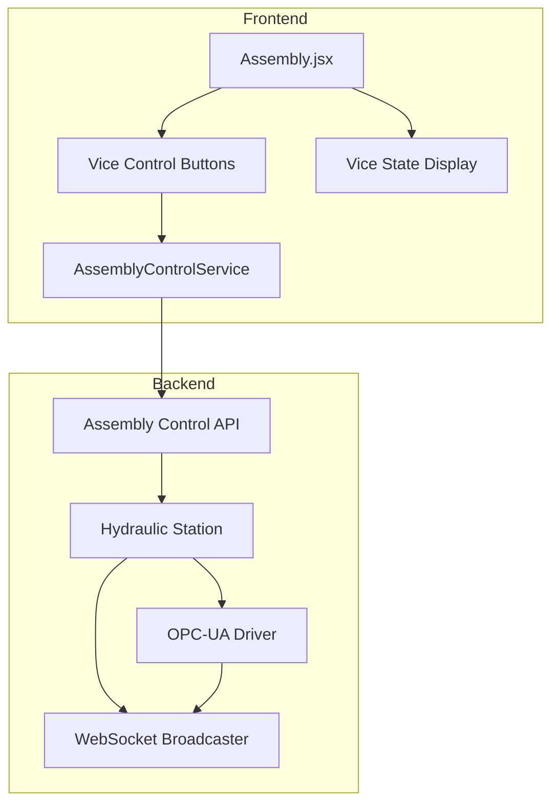
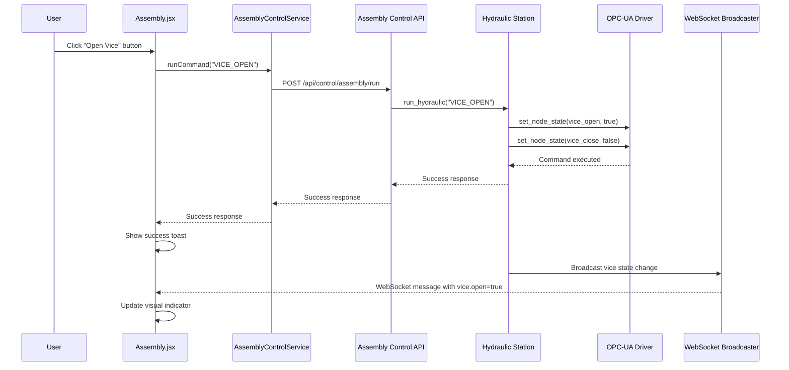

# Design Document: Independent Vice Control

## Overview

This feature adds independent vice control to the assembly station (hydraulic press) in the CoEDM Smart Manufacturing Control system. The vice is a mechanical clamping mechanism that holds workpieces during assembly operations. Currently, the vice state is monitored via OPC-UA tags but cannot be controlled independently. This design specifies the implementation of vice open/close commands that operate independently of bearing/shaft operations.

### Key Design Principles

1. **Independence**: Vice operations must not affect bearing/shaft states
2. **State Consistency**: Vice open and close tags are mutually exclusive (only one can be true at a time)
3. **Error Handling**: Clear error messages for connection issues, invalid commands, and timeouts
4. **Real-time Updates**: WebSocket broadcasts vice state changes immediately
5. **UI Feedback**: Visual indicators for vice state, loading states, and disabled buttons

## Architecture

### Component Diagram



### Data Flow Diagram



## Components and Interfaces

### Backend Components

#### 1. Hydraulic Station (`hydraulic_station.py`)

**Current State:**
- `HYDRAULIC_TAGS`: Contains `BEARING_ON` and `SHAFT_ON` commands
- `HYDRAULIC_DATA_TAGS`: Contains `vice_open` and `vice_close` for reading state
- `run_hydraulic()`: Executes commands by setting OPC-UA tags

**Changes Required:**
- Add `VICE_OPEN` and `VICE_CLOSE` to `HYDRAULIC_TAGS`
- Update `run_hydraulic()` to handle vice commands
- Ensure vice commands don't affect bearing/shaft states

#### 2. Assembly Control API (`assembly_control.py`)

**Current State:**
- `/run` endpoint accepts `BEARING_ON` and `SHAFT_ON` commands
- Validates commands against `HYDRAULIC_TAGS`
- Returns success/error responses

**Changes Required:**
- No changes needed - API already uses `HYDRAULIC_TAGS` dynamically

#### 3. WebSocket Broadcaster (`assembly_broadcaster.py`)

**Current State:**
- Broadcasts `vice.open` and `vice.close` states in WebSocket messages
- Already includes vice state in payload

**Changes Required:**
- No changes needed - already broadcasts vice state

### Frontend Components

#### 1. Assembly.jsx

**Current State:**
- Displays vice state in "Clamp & Workpiece" HUD
- Shows "Vice Jaws Status" as OPEN/CLOSED/UNKNOWN
- Has bearing/shaft command buttons

**Changes Required:**
- Add vice open/close buttons to command panel
- Add loading states for vice commands
- Disable buttons based on vice state and connection status

#### 2. AssemblyControlService.js

**Current State:**
- `runCommand()` method sends commands to backend
- Handles connection/disconnection

**Changes Required:**
- No changes needed - already supports dynamic commands

## Data Models

### OPC-UA Tags

| Tag Name | Node ID | Description | Access |
|----------|---------|-------------|--------|
| `vice_open` | `|var|AX-308EA0MA1P.Application.GVL.open` | Vice open state (true=open) | Read/Write |
| `vice_close` | `|var|AX-308EA0MA1P.Application.GVL.Close` | Vice close state (true=closed) | Read/Write |

### WebSocket Payload (Existing)

```json
{
  "connected": true,
  "timestamp": 1234567890.123,
  "assembly": {
    "bearing": true,
    "shaft": false
  },
  "position": {
    "displacement_mm": 45.5
  },
  "vice": {
    "open": true,
    "close": false
  },
  "safety": {
    "buzzer": false,
    "curtain": false,
    "lights": {
      "red": false,
      "orange": false,
      "green": false
    }
  }
}
```

### API Request/Response

**Request:**
```json
{
  "command": "VICE_OPEN"
}
```

**Success Response:**
```json
{
  "success": true,
  "command": "VICE_OPEN",
  "tag": "|var|AX-308EA0MA1P.Application.GVL.open",
  "message": "Hydraulic command 'VICE_OPEN' executed successfully"
}
```

**Error Response:**
```json
{
  "detail": "Invalid command. Available commands: [...]"
}
```

## Correctness Properties

### Property 1: Vice Open Command Sets Correct Tags

*For any* valid vice open command, the system shall set the `vice_open` tag to `true` and the `vice_close` tag to `false`, without modifying the `bearing_operation` or `shaft_operation` tags.

**Validates: Requirements 1.2, 3.1**

### Property 2: Vice Close Command Sets Correct Tags

*For any* valid vice close command, the system shall set the `vice_close` tag to `true` and the `vice_open` tag to `false`, without modifying the `bearing_operation` or `shaft_operation` tags.

**Validates: Requirements 2.2, 3.1**

### Property 3: Connection State Validation

*For any* vice command, if the OPC-UA connection is not established, the system shall return an error response indicating connection is required before executing the command.

**Validates: Requirements 1.3, 2.3, 5.1**

### Property 4: WebSocket State Broadcast

*For any* successful vice command execution, the system shall broadcast the updated vice state via WebSocket within 100ms.

**Validates: Requirements 1.4, 2.4**

### Property 5: Independent Operation

*For any* sequence of vice, bearing, and shaft commands, executing a vice command shall not modify the bearing or shaft operation states, and vice versa.

**Validates: Requirements 3.1, 3.2, 3.3**

### Property 6: UI State Display

*For any* vice state (open, close, or unknown), the UI shall display the corresponding status text ("Vice: Open", "Vice: Closed", or "Vice: Unknown") with appropriate visual styling.

**Validates: Requirements 4.1, 4.2, 4.3, 4.4, 4.5**

### Property 7: Button State Management

*For any* vice state and connection status, the UI shall disable the "Open Vice" button when vice is open, disable the "Close Vice" button when vice is closed, and show loading states during command execution.

**Validates: Requirements 6.2, 6.3, 6.4**

## Error Handling

### Connection Errors

| Scenario | Error Message | UI Action |
|----------|---------------|-----------|
| OPC-UA not connected | "Connection required. Please connect to the hydraulic station first." | Show toast error, don't execute command |
| Connection lost during command | "Connection lost during command execution. Please reconnect." | Show toast error, update connection status |

### Command Validation Errors

| Scenario | Error Message | UI Action |
|----------|---------------|-----------|
| Invalid command | "Invalid command. Available commands: VICE_OPEN, VICE_CLOSE, BEARING_ON, SHAFT_ON" | Show toast error |
| Empty command | "Command is required" | Show toast error |

### Timeout Errors

| Scenario | Error Message | UI Action |
|----------|---------------|-----------|
| Command timeout (>5s) | "Command timed out. The hydraulic station did not respond within 5 seconds. Please check the connection and try again." | Show toast error, enable button |

### Hydraulic Station Errors

| Scenario | Error Message | UI Action |
|----------|---------------|-----------|
| Station returns error | Forward station error message | Show toast error with station message |

## Testing Strategy

### Backend Testing

**Unit Tests:**
- Test `run_hydraulic("VICE_OPEN")` sets correct tags
- Test `run_hydraulic("VICE_CLOSE")` sets correct tags
- Test connection validation before command execution
- Test error handling for invalid commands
- Test independence from bearing/shaft states

**Integration Tests:**
- Test full command flow from API to OPC-UA
- Test WebSocket broadcast after command execution
- Test concurrent vice and bearing/shaft operations

### Frontend Testing

**Unit Tests:**
- Test button click triggers correct service call
- Test loading state during command execution
- Test button disabled states based on vice state
- Test error toast display on failure

**Integration Tests:**
- Test WebSocket data flow from backend to UI
- Test vice state display updates within 1 second
- Test concurrent operations don't interfere

### Property-Based Tests

**Property 1 Test:**
- Generate random vice open commands
- Verify `vice_open=true`, `vice_close=false`, bearing/shaft unchanged

**Property 2 Test:**
- Generate random vice close commands
- Verify `vice_close=true`, `vice_open=false`, bearing/shaft unchanged

**Property 3 Test:**
- Generate connection failure scenarios
- Verify error responses for all vice commands

**Property 4 Test:**
- Generate vice commands
- Verify WebSocket broadcast contains updated vice state

**Property 5 Test:**
- Generate random sequences of vice, bearing, shaft commands
- Verify no cross-interference between operation types

## Implementation Tasks

### Phase 1: Backend Changes

- [ ] 1.1 Update `HYDRAULIC_TAGS` in `hydraulic_station.py`
  - Add `VICE_OPEN` and `VICE_CLOSE` entries
  - _Requirements: 1.1, 2.1_

- [ ] 1.2 Update `run_hydraulic()` function in `hydraulic_station.py`
  - Add vice command handling logic
  - Ensure vice commands don't affect bearing/shaft states
  - _Requirements: 1.2, 2.2, 3.1_

- [ ] 1.3 Add connection state validation
  - Check `opcua_connection.connected` before executing commands
  - Return appropriate error if not connected
  - _Requirements: 1.3, 2.3, 5.1_

### Phase 2: Frontend Changes

- [ ] 2.1 Add vice control buttons to Assembly.jsx
  - Add "Open Vice" and "Close Vice" buttons
  - Position in command panel alongside bearing/shaft buttons
  - _Requirements: 6.1_

- [ ] 2.2 Implement button state management
  - Disable "Open Vice" when vice is open
  - Disable "Close Vice" when vice is closed
  - Show loading state during command execution
  - _Requirements: 6.2, 6.3, 6.4_

- [ ] 2.3 Add vice command handlers
  - Implement `handleViceOpen()` and `handleViceClose()`
  - Call `AssemblyControlService.runCommand()`
  - Handle success/error responses with toast notifications
  - _Requirements: 1.1, 2.1, 5.5_

- [ ] 2.4 Verify vice state display
  - Confirm "Vice Jaws Status" shows OPEN/CLOSED/UNKNOWN
  - Verify visual styling for each state
  - _Requirements: 4.1, 4.2, 4.3, 4.4, 4.5_

### Phase 3: Testing

- [ ] 3.1 Write backend unit tests for vice commands
  - Test tag setting for vice open/close
  - Test connection validation
  - Test independence from bearing/shaft
  - _Requirements: 1.2, 2.2, 3.1, 5.1_

- [ ] 3.2 Write frontend integration tests
  - Test button clicks trigger service calls
  - Test loading states display correctly
  - Test button disabled states
  - _Requirements: 6.1, 6.2, 6.3, 6.4_

- [ ] 3.3 Test WebSocket broadcast
  - Verify vice state changes broadcast via WebSocket
  - Verify UI updates within 1 second
  - _Requirements: 1.4, 2.4, 6.5_

### Phase 4: Error Handling Verification

- [ ] 4.1 Test connection error scenarios
  - Verify error messages when not connected
  - Verify error messages when connection lost
  - _Requirements: 1.3, 2.3, 5.1_

- [ ] 4.2 Test invalid command scenarios
  - Verify validation errors for invalid commands
  - Verify error messages are descriptive
  - _Requirements: 5.2_

- [ ] 4.3 Test timeout scenarios
  - Verify timeout error messages
  - Verify retry guidance in messages
  - _Requirements: 5.4_

## Notes

- The vice state is already being read from OPC-UA and broadcast via WebSocket
- The API layer is dynamic and doesn't require changes for new commands
- Frontend vice state display is already implemented in the "Clamp & Workpiece" HUD
- Only the command buttons and handlers need to be added to the frontend
- Vice open and close are mutually exclusive (only one can be true at a time)
- Vice operations are completely independent of bearing/shaft operations