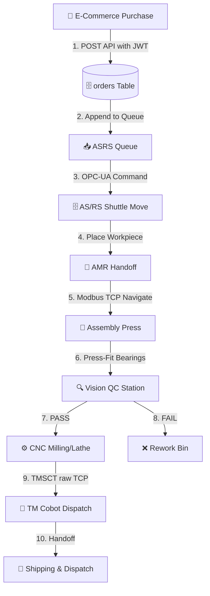
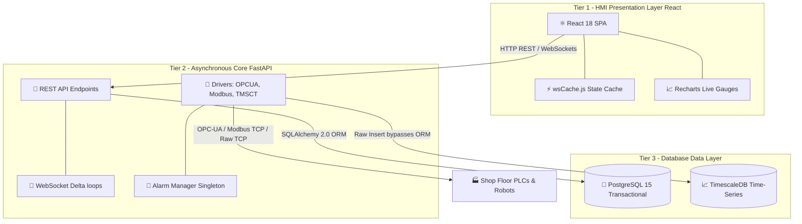
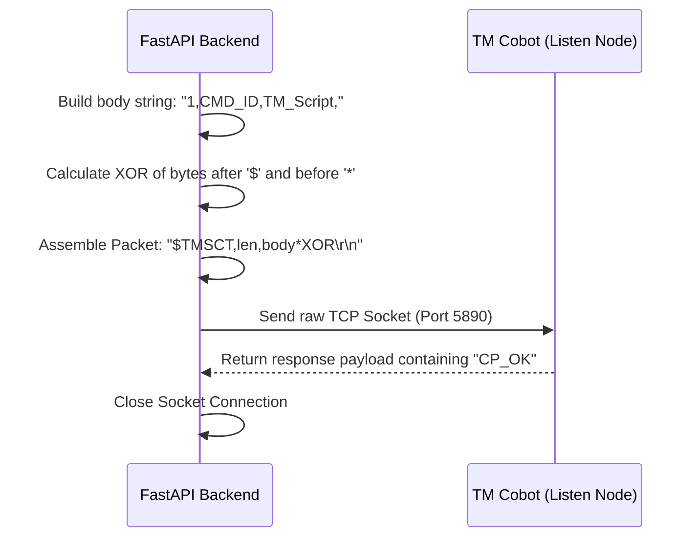
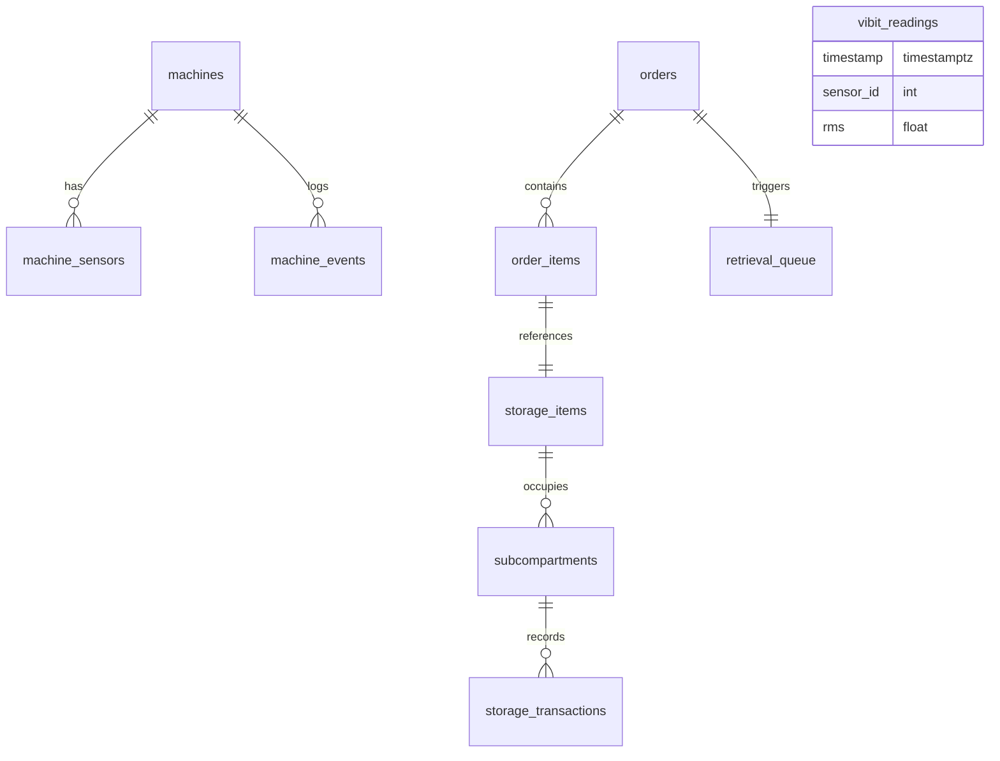

# CoEDM Smart Manufacturing Control Software
## Detailed Technical & Non-Technical Project Overview
### Centre of Excellence in Digital Manufacturing — BVM Engineering College, Anand

---

> **Project ID:** 2026.05.1 &nbsp;|&nbsp; **Version:** v4.3.0-CI-DEPLOYED &nbsp;|&nbsp; **Internship:** May 2026
>
> **Institution:** BVM Engineering College, Vallabh Vidyanagar, Anand 388120, Gujarat, India

---

## Table of Contents
1. [Executive Summary](#1-executive-summary)
2. [Manufacturing Line Flow](#2-manufacturing-line-flow)
3. [System Architecture](#3-system-architecture)
4. [Communication Protocols](#4-communication-protocols)
5. [Technology Stack](#5-technology-stack)
6. [Station Modules — AS/RS](#6-station-modules--asrs)
7. [Station Modules — MIRAC CNC](#7-station-modules--mirac-cnc)
8. [Station Modules — TRIAC CNC](#8-station-modules--triac-cnc)
9. [Station Modules — Assembly Press](#9-station-modules--assembly-press)
10. [Station Modules — AMR Robot](#10-station-modules--amr-robot)
11. [Station Modules — TM Cobot](#11-station-modules--tm-cobot)
12. [Core Infrastructure](#12-core-infrastructure)
13. [Database Architecture](#13-database-architecture)
14. [Frontend Architecture](#14-frontend-architecture)
15. [E-Commerce Portal](#15-e-commerce-portal)
16. [API Reference](#16-api-reference)
17. [Deployment & DevOps](#17-deployment--devops)
18. [Key Engineering Decisions](#18-key-engineering-decisions)
19. [Project Metrics & Numbers](#19-project-metrics--numbers)
20. [Future Roadmap](#20-future-roadmap)
21. [Glossary](#21-glossary)

---

## 1. Executive Summary

The **CoEDM Smart Manufacturing Control Software** is a full-stack industrial control platform that unifies 7 heterogeneous factory floor machines under a single browser-accessible HMI. Built during the May 2026 CoEDM Internship at BVM Engineering College, it replaces manual PLC terminal interactions with a centralized, real-time monitoring and control system.

### Business & Operational Impact (Non-Technical)
* **Centralized Supervision:** Operators can monitor all machine states, warnings, and alarm parameters from a single dashboard.
* **Unified Inventory & Fulfillment:** Connects customer purchases directly to the physical storage shuttle, automatically dispatching stock.
* **Safety Lockouts:** Instant shop-floor-wide control blocks when safety curtain breaches occur, protecting operators and machines.

### Engineering & System Capabilities (Technical)
* **Heterogeneous Driver Pooling:** Thread-safe lazy connection wrappers for OPC-UA, Modbus TCP, and TMSCT socket servers.
* **High-Frequency Aggregations:** TimescaleDB hypertables store accelerometer datasets with partition intervals.
* **Delta Broadcasters:** WebSockets compute telemetry difference deltas on the fly, saving over 80% bandwidth.

---

## 2. Manufacturing Line Flow

The sequence of operations required to fulfill customer orders from initial transaction to final dispatch.

### High-Level Manufacturing Flow Chart


### Protocol and IP Mapping Table
| Step | Station Module | Protocol | Target IP & Port |
|------|----------------|----------|------------------|
| Retrieval | AS/RS Shuttle | OPC-UA | `10.10.14.104:4840` |
| Transfer | AMR Robot | Modbus TCP | `10.10.14.122:502` |
| Assembly | Hydraulic Press | OPC-UA | `10.10.14.113:4840` |
| Machining | MIRAC CNC Lathe | OPC-UA + Modbus | `10.10.14.102` + `103` |
| Machining | TRIAC CNC Mill | OPC-UA + Modbus | `10.10.14.125` + `129` |
| Pick-place| TM Cobot | Raw TCP/TMSCT | `10.10.14.106:5890` |

---

## 3. System Architecture

The platform operates on a modular 3-tier architecture, separating presentation interfaces, application rules, and physical device drivers.

### 3-Tier Layered Diagram


---

## 4. Communication Protocols

### 4.1 OPC-UA
* **Role:** Controls the AS/RS Shuttle, MIRAC Lathe, TRIAC Mill, and Assembly Press.
* **Mechanism:** Lazy connection initialized on the first operator request. A background daemon thread reads the server status node `ns=0;i=2259` every 5 seconds to manage auto-reconnect sequences and subscription recovery.

### 4.2 Modbus TCP
* **Role:** Transmits coordinates to the AMR Robot and aggregates accelerometer telemetry from VibIT gateways.
* **Register Mapping:**
```
  Holding Register Addresses:
  ┌──────────────────────────────────────────────────────────┐
  │ 4000-4001: Spindle Bearing RMS Float (Unit 1)            │
  │ 4002-4003: Spindle Peak Vibration Frequency (Unit 1)     │
  │ 4004-4005: Tool Holder RMS Float (Unit 2)                │
  │ 4006-4007: Tool Holder Peak Frequency (Unit 2)           │
  │ 4008-4009: Axis Vibration RMS Float (Unit 3)             │
  │ 4010-4011: Axis Peak Frequency (Unit 3)                  │
  └──────────────────────────────────────────────────────────┘
```

### 4.3 Raw TCP (TMSCT Checksum Handshake)
* **Role:** Sends movement script blocks to the Techman Collaborative Robot.
* **Checksum Execution Flow:**


### 4.4 WebSocket Delta Broadcast Protocol
To minimize LAN overhead, WebSockets transmit differences rather than full JSON packets:
```
  Client Connects   ──▶   Server sends full state snapshot JSON
  
  Poll Loop (200ms) ──▶   If telemetry changes:
                            Server computes deep_diff()
                            Server transmits Delta JSON
                          Else:
                            Server transmits short Heartbeat
```

---

## 5. Technology Stack

| Layer | Component | Version | Rationale |
|------|-----------|---------|-----------|
| Backend | **FastAPI** | 0.115 | Asynchronous coroutines, OpenAPI docs, fast routing |
| Database | **PostgreSQL** | 15.0 | Transaction integrity (ACID) for ordering/ASRS |
| Time-Series | **TimescaleDB** | 2.12 | Partitioned hypertables for high-speed sensor readings |
| Frontend | **React** | 18.2 | Declarative component rendering, hook-based WS updates |
| Charts | **Recharts** | 2.10 | Low-overhead SVG charts for HMI oscilloscopes |
| Serialization| **orjson** | 3.9 | Fast Rust-backed serializer for delta packets |

---

## 6. Station Modules — AS/RS
* **Hardware:** 35-bin coordinate rack layout (5 Columns × 7 Rows). Subdivided into 6 subcompartments per bin (total capacity = 210 slots).
* **Database Guard Pattern:** Writing to the ASRS OPC-UA tag runs inside a database transaction context. If the physical PLC command fails to execute, the transaction rolls back, preventing incorrect inventory states.

---

## 7. Station Modules — MIRAC CNC Lathe
* **Hardware:** CNC lathe controlled via CODESYS OPC-UA namespace, equipped with 3 VibIT Modbus accelerometer nodes.
* **Telemetry Thresholds:**
```
  Vibration Level (g RMS):
  0.0  ┌───────────────────────────────────┐
       │ Normal (0.01 - 0.05 g)            │ → Green Status
  0.08 ├───────────────────────────────────┤
       │ Warning (0.08 - 0.14 g)           │ → Orange Status
  0.15 ├───────────────────────────────────┤
       │ CRITICAL (>= 0.15 g)              │ → RED / Alarm Mode
       └───────────────────────────────────┘
```

---

## 8. Station Modules — TRIAC CNC Mill
* **Hardware:** CNC vertical mill running parallel to the MIRAC architecture.
* **HMI Optimizations:** Recharts vibration graphs render outside the React reconciliation thread. Instead, `requestAnimationFrame` writes telemetry variables directly to SVG path properties, achieving a smooth 60fps vibration flow.

---

## 9. Station Modules — Assembly Press
* **Hardware:** Hydraulic press-fitting piston controlled via OPC-UA.
* **Interlock Rules:**
  1. `BEARING_ON` and `SHAFT_ON` commands are mutually locked at the backend application layer.
  2. Safety laser curtain breach triggers a critical interrupt flag, immediately freezing all shop floor movements.

---

## 10. Station Modules — AMR Robot
* **Hardware:** Wheeled autonomous mobile robot routed across 7 named shop floor coordinate zones:
```
  AMR Coordinates System:
  ┌──────────────────────────────────────────────────────────┐
  │ ASRS (0.5, 2.1)   ·   INSPECTION (3.2, 2.1)  ·  TESTING (5.8, 2.1)
  │                                                          │
  │ MIRAC (1.5, 4.5)  ·   HOME (3.5, 4.0)        ·  TRIAC (5.5, 4.5)
  │                                                          │
  │ ASSEMBLY (3.0, 6.2)                                      │
  └──────────────────────────────────────────────────────────┘
```
* **Proximity Check:** Target reached if Euclidean distance $\sqrt{(x_1 - x_2)^2 + (y_1 - y_2)^2} < 0.25$ meters.

---

## 11. Station Modules — TM Cobot
* **Hardware:** Techman robot arm handling pick-and-place operation queues via raw TCP script dispatch.
* **Timeout Protections:** A 5-second socket timeout enforces connection safety, avoiding thread locks if the robot controller drops offline.

---

## 12. Core Infrastructure
* **OPC-UA connection pooling:** Singleton client registry guarantees one OPC-UA socket thread per machine, serializing write events.
* **VibitGateway register locks:** Prevents connection refusals from the VibIT hardware by serializing registry queries through a shared `RLock`.

---

## 13. Database Architecture

The relational schema coordinates shop transactions, order details, machine alarms, and partitioned hypertables.

### Entity Relationship Diagram (ERD)


---

## 14. Frontend HMI Architecture
* **wsCache.js State Store:** Global in-memory cache retaining telemetry data across React page transitions.
* **Smooth Interpolations:** A critically-damped spring physics model translates slow 1Hz PLC data updates into smooth visual displacements on the HMI actuator animations.

---

## 15. E-Commerce Portal
* **Role:** Connects user purchases directly to shop floor queue dispatches.
* **Fulfillment Pipeline:**
  1. User orders bear housing via the shopping page (JWT authorized).
  2. Inventory availability is verified in the `subcompartments` table.
  3. Order logs are committed, appending retrieval tasks to `retrieval_queue`.
  4. The queue dispatcher issues the OPC-UA move command to the ASRS PLC.

---

## 16. API Reference

### Primary Control Endpoints
* `POST /api/control/asrs/store` -> Command ASRS to store item.
* `POST /api/control/asrs/retrieve` -> Command ASRS to retrieve item.
* `POST /api/control/mirac/command` -> Cycle Start/Stop/Reset lathe.
* `POST /api/control/assembly/command` -> Actuate hydraulic press movements.
* `POST /api/control/amr/dispatch` -> Navigate robot to coordinate zone.

---

## 17. Deployment & DevOps
* **Docker Compose Services:** Orchestrates the PostgreSQL database, FastAPI backend application, HMI static Nginx server, and E-commerce static Nginx server.
* **Healthcheck Dependencies:** Backend containers boot only after TimescaleDB finishes initializing and passes its `pg_isready` check.

---

## 18. Key Engineering Decisions
1. **DB-First ASRS Commit:** Commits database inventory changes ONLY after the physical PLC registers a successful shuttle move.
2. **Shared Modbus Registry:** Solves VibIT hardware's single-connection limitation by wrapping queries in a shared singleton class.
3. **No-React Rendering:** Bypasses React state updates for vibration graphing and cylinder animations, avoiding DOM bottlenecks.

---

## 19. Project Metrics & Numbers

```
  HMI Code Footprint (Largest JSX Component Files):
  ┌──────────────────────────────────────────────────────────┐
  │ Triac.jsx (Milling HMI)        ░░░░░░░░░░░░░░░░░░░ 84 KB │
  │ Assembly.jsx (Press HMI)       ░░░░░░░░░░░░░░░░░░░ 84 KB │
  │ Mirac.jsx (Lathe HMI)          ░░░░░░░░░░░░░░░░    72 KB │
  │ mirac_broadcaster.py (API)     ░░░░░░░░░           44 KB │
  │ triac_broadcaster.py (API)     ░░░░░░░             39 KB │
  └──────────────────────────────────────────────────────────┘
```

---

## 20. Future Roadmap
* **Q3 2026:** AI-based machine vision quality check integrations at the QC station.
* **Q4 2026:** Complete automated manufacturing loop orchestration engine connecting ASRS, AMR, and Press.
* **Q1 2027:** TimescaleDB continuous aggregate analytical calculations (OEE reports) and predictive maintenance spindle failure alerts.

---

## 21. Glossary
* **OEE:** Overall Equipment Effectiveness ($Availability \times Performance \times Quality$).
* **Hypertable:** TimescaleDB table partitioned automatically into time-based database chunks.
* **TMSCT:** Techman Script Communication protocol over raw TCP sockets.
* **wsCache:** Global in-memory cache preventing React route reload latencies.

---
*Document Version: 3.0 — Enhanced with Diagrams, Sequences, and Technical Flowcharts*
*Generated: July 2026 — BVM Centre of Excellence in Digital Manufacturing*
