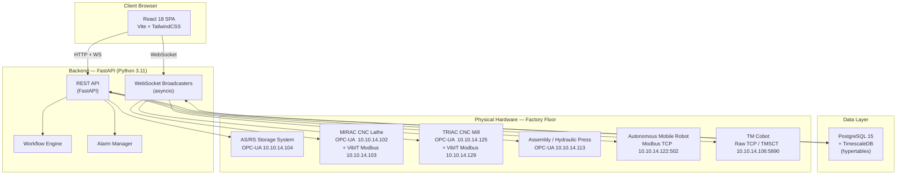
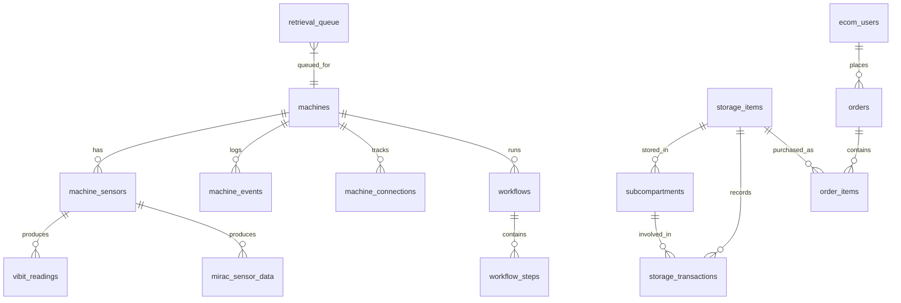

# CoEDM Smart Manufacturing Control Software
### Centralized Industrial Control Platform — BVM Engineering College, Anand, Gujarat
**Project ID:** 2026.05.1 | **CoEDM Internship Program — May 2026**

---

## 1. Executive Summary

The **CoEDM Smart Manufacturing Control Software** is a full-stack, real-time industrial control and monitoring platform built for the autonomous smart manufacturing line at the **Centre of Excellence in Digital Manufacturing (CoEDM)**, BVM Engineering College.

The system integrates **7 heterogeneous machines** on a factory floor into a single, browser-accessible HMI portal — replacing manual PLC terminals with a unified software layer. It handles physical machine communication (OPC-UA, Modbus TCP, raw TCP), real-time telemetry streaming (WebSockets), event persistence (PostgreSQL + TimescaleDB), and an end-to-end order-to-dispatch workflow for customers.

> **Manufacturing Line Flow:**
> ```
> Customer Order → AS/RS → AMR Transfer → Assembly → Inspection → [Accept / Reject / Rework] → CNC / Storage
> ```

---

## 2. Problem Statement

| Challenge | Before This System |
|---|---|
| Machine control | Engineers had to walk to each PLC terminal to issue commands |
| Monitoring | No unified dashboard; each machine had its own disconnected HMI |
| Data logging | No persistent event or alarm history |
| Order processing | Manual stock checking and physical retrieval |
| Vibration analysis | Node-RED dashboards with no persistent storage or trend analysis |
| AMR navigation | No software-level dispatch control |
| Safety monitoring | No centralized safety curtain / alarm notification |

---

## 3. System Architecture



### Communication Protocols Used

| Protocol | Machines | Purpose |
|---|---|---|
| **OPC-UA** (`asyncua`) | ASRS, MIRAC, TRIAC, Assembly | Tag reads/writes, subscriptions, PLC control |
| **Modbus TCP** (`pymodbus`) | AMR, VibIT sensors (MIRAC + TRIAC) | Navigation dispatch, vibration telemetry |
| **Raw TCP / TMSCT** | TM Cobot | Script execution via Techman TMSCT protocol |
| **WebSocket** | All stations to Browser | Real-time bidirectional telemetry streaming |
| **HTTP REST** | All | Control commands, data queries, health checks |

---

## 4. Tech Stack

| Layer | Technology | Why |
|---|---|---|
| **Backend** | Python 3.11, FastAPI | Async-native, high performance, auto OpenAPI docs |
| **Database** | PostgreSQL 15, TimescaleDB, SQLAlchemy ORM | Time-series hypertables for sensor data, ACID transactions |
| **Frontend** | React 18, Vite, TailwindCSS | Component-based, lazy-loading, fast HMR |
| **Charts** | Recharts | Declarative SVG charting for telemetry |
| **Animation** | Framer Motion | Physics-based machine animations |
| **Serialization** | orjson | 5-10x faster JSON than stdlib for hot WS paths |
| **Deployment** | Docker Compose (3 + 1 services) | One-command reproducible deployment |
| **Testing** | pytest, httpx | API integration tests |
| **Migrations** | Alembic | Schema version control |

---

## 5. Station Modules — Detailed Breakdown

### 5.1 — AS/RS (Automated Storage and Retrieval System)
**Protocol:** OPC-UA (`opc.tcp://10.10.14.104:4840`)

The ASRS is a motorized rack-and-shuttle storage system with a **5-column x 7-row grid** (35 bins), each bin having **6 subcompartments** (210 total slots).

**Key Features:**
- **LED-based occupancy monitoring** — Each bin's LED state is subscribed via OPC-UA change notifications and reflected live on the HMI grid (green = occupied, red = empty)
- **Shuttle tracking** — Real-time X/Y position of the retrieval shuttle shown on an animated `ShuttleRail` component
- **Store/Retrieve operations** — DB-first algorithm: update PostgreSQL then compute PLC command then execute; rolled back if PLC fails
- **Safety Curtain** — Detects interruption mid-operation and triggers a critical alarm + WebSocket broadcast
- **Drop-off zone** — Dedicated handoff position for AMR transfers

**Database algorithm (ASRS Logic):**
```
1. Validate inputs (box_id, sub_id, item_id)
2. Check item and box exist in DB
3. Verify subcompartment availability
4. Send PLC command (e.g., "A1S") for store
5. Only on PLC success - update DB record + log storage_transaction
6. Return combined PLC + DB status
```

**Backend files:** [asrs_station.py](file:///c:/V33R/Programming/Projects/BVM_CoEDM_Internship/v1.0/CoEDM-smart-manufacturing-control/backend/stations/asrs/asrs_station.py) · [asrs_logic.py](file:///c:/V33R/Programming/Projects/BVM_CoEDM_Internship/v1.0/CoEDM-smart-manufacturing-control/backend/stations/asrs/asrs_logic.py) · [led_service.py](file:///c:/V33R/Programming/Projects/BVM_CoEDM_Internship/v1.0/CoEDM-smart-manufacturing-control/backend/stations/asrs/led_service.py) · [shuttle.py](file:///c:/V33R/Programming/Projects/BVM_CoEDM_Internship/v1.0/CoEDM-smart-manufacturing-control/backend/stations/asrs/shuttle.py)

---

### 5.2 — MIRAC CNC Lathe (Smart MIRAC)
**Protocol:** OPC-UA (`opc.tcp://10.10.14.102:4840`) + Modbus TCP VibIT sensors (`10.10.14.103:502`)

The MIRAC is a CNC turning lathe with an integrated vibration monitoring subsystem using **3 VibIT Modbus sensors** measuring spindle bearing vibration (X/Y/Z, envelope RMS), tool holder vibration, and axes vibration.

**Key Features:**
- **OPC-UA Tags monitored:** spindle speed (RPM), spindle temperature, tool number, X/Z axis position and feed rate, LED status (Red/Yellow/Green), pneumatic chuck state
- **Remote control:** Cycle Start / Stop / Reset pulses via OPC-UA write (500ms pulse width)
- **VibIT sensor auto-detection:** Automatically probes Modbus register profiles to find the correct float-decode layout
- **Shared gateway architecture:** A single `ModbusTcpClient` is shared across all 3 VibIT unit IDs (VibIT gateway only allows 1 TCP connection) via `VibitGateway` class-level registry
- **60fps axis animation:** Uses `requestAnimationFrame` + spring physics (critically-damped) instead of React setState for the SVG machine view
- **Delta-only WebSocket protocol:** Broadcaster only sends changed fields; new clients receive an immediate full snapshot
- **PLC node cache:** Caches resolved OPC-UA node objects across cycles; cleared on reconnect

**Backend files:** [cnc_mirac_station.py](file:///c:/V33R/Programming/Projects/BVM_CoEDM_Internship/v1.0/CoEDM-smart-manufacturing-control/backend/stations/mirac/cnc_mirac_station.py) · [mirac_broadcaster.py](file:///c:/V33R/Programming/Projects/BVM_CoEDM_Internship/v1.0/CoEDM-smart-manufacturing-control/backend/websockets/mirac_broadcaster.py) · [vibit_modbus.py](file:///c:/V33R/Programming/Projects/BVM_CoEDM_Internship/v1.0/CoEDM-smart-manufacturing-control/backend/communication/vibit_modbus.py)

---

### 5.3 — TRIAC CNC Mill (Smart TRIAC)
**Protocol:** OPC-UA (`opc.tcp://10.10.14.125:4840`) + Modbus TCP VibIT sensors (`10.10.14.129:502`)

Functionally mirrors the MIRAC architecture but for a vertical milling machine. Monitors spindle speed, tool vibration, axes (X/Y/Z) position and feed rates with 3 independent VibIT sensors.

**Frontend file:** [Triac.jsx](file:///c:/V33R/Programming/Projects/BVM_CoEDM_Internship/v1.0/CoEDM-smart-manufacturing-control/frontend/src/pages/Triac.jsx) (84 KB — most feature-rich page in the project)

---

### 5.4 — Assembly / Hydraulic Press Station
**Protocol:** OPC-UA (`opc.tcp://10.10.14.113:4840`)

A hydraulic press station used for **press-fitting bearings and shafts** onto workpieces.

**Key Features:**
- **Press commands:** `BEARING_ON`, `SHAFT_ON`, `VICE_OPEN`, `VICE_CLOSE` — interlocked (bearing and shaft are mutually exclusive)
- **Real-time displacement monitoring:** Reads `mm` variable from PLC (displacement in mm); rendered on an animated SVG schematic showing piston rod extension
- **Safety system:** Monitors safety curtain + buzzer state; triggers `SafetyOverlay` component blocking all controls when tripped
- **Dual canvas rendering:** Raw signal canvas + critically-damped filtered signal canvas without React setState in the render loop
- **Recharts telemetry graph:** Scrolling historical displacement plot with configurable window

**OPC-UA tags mapped:**
```
BEARING_ON  → PLC_PRG.Opration_Bering_On
SHAFT_ON    → PLC_PRG.Opration_Shaft_On
VICE        → GVL.open / GVL.Close
POSITION    → GVL.mm
SAFETY      → GVL.Buzzer (curtain) / PLC_PRG.output06 (buzzer)
```

**Backend files:** [hydraulic_station.py](file:///c:/V33R/Programming/Projects/BVM_CoEDM_Internship/v1.0/CoEDM-smart-manufacturing-control/backend/stations/assembly/hydraulic_station.py) · [assembly_broadcaster.py](file:///c:/V33R/Programming/Projects/BVM_CoEDM_Internship/v1.0/CoEDM-smart-manufacturing-control/backend/websockets/assembly_broadcaster.py)

---

### 5.5 — AMR (Autonomous Mobile Robot)
**Protocol:** Modbus TCP (`10.10.14.122:502`)

A wheeled autonomous mobile robot that transfers workpieces between stations on the factory floor.

**Key Features:**
- **Station dispatch:** Sends a station name string (`ASRS`, `MIRAC`, `TRIAC`, `ASSEMBLY`, `TESTING`, `INSPECTION`, `HOME`) over raw TCP; the robot's onboard nav stack executes the navigation
- **Real-world coordinate mapping:** AMR reports live X/Y position; software maps these to station names using proximity thresholds (< 0.25m) or falls back to weighted inverse-distance interpolation for in-transit positions
- **Visual floor map:** SVG floor plan showing 7 named stations; a moving dot represents the AMR rendered at screen-space coordinates derived from real-world meters
- **Position trail:** Rolling 40-point history of the AMR's path drawn as a polyline
- **Manual connect mode:** AMR connection is not started at server boot — only established when the user explicitly clicks "Connect" from the UI
- **Reconnect logic:** Up to 3 auto-reconnect attempts with 1-second backoff

**Coordinate system (synchronized with robot nav node):**

| Station | Real X, Y (meters) |
|---|---|
| ASRS | (-4.0, 0.2) |
| HOME | (0.0, 0.0) |
| TRIAC | (1.476, 0.406) |
| MIRAC | (4.149, 0.428) |
| ASSEMBLY | (5.631, 1.215) |
| INSPECTION | (-3.0, 0.2) |
| TESTING | (-2.0, 0.2) |

**Backend files:** [amr_controller.py](file:///c:/V33R/Programming/Projects/BVM_CoEDM_Internship/v1.0/CoEDM-smart-manufacturing-control/backend/stations/amr/amr_controller.py) · [amr_broadcaster.py](file:///c:/V33R/Programming/Projects/BVM_CoEDM_Internship/v1.0/CoEDM-smart-manufacturing-control/backend/websockets/amr_broadcaster.py)

---

### 5.6 — TM Cobot (Collaborative Robot)
**Protocol:** Raw TCP / TMSCT (`10.10.14.106:5890`)

A Techman collaborative robot arm used for pick-and-place operations.

**Key Features:**
- **TMSCT protocol implementation:** Custom packet builder with XOR checksum: `$TMSCT,<len>,<id>,<script>,*<checksum>\r\n`
- **Script dispatch:** Sends TM Script language commands to trigger pre-programmed sequences (e.g., pick part, place part)
- **Listen node trigger:** Communicates with the robot while it waits at a "Listen" node in its flow program

**Backend file:** [cobot_station.py](file:///c:/V33R/Programming/Projects/BVM_CoEDM_Internship/v1.0/CoEDM-smart-manufacturing-control/backend/stations/cobot/cobot_station.py)

---

## 6. Core Infrastructure

### 6.1 — OPC-UA Connection Manager
[opcua_driver.py](file:///c:/V33R/Programming/Projects/BVM_CoEDM_Internship/v1.0/CoEDM-smart-manufacturing-control/backend/communication/opcua_driver.py)

A reusable, thread-safe wrapper around `asyncua.sync.Client`:
- **Single session guarantee** — Only one `Client` object exists per connection
- **Background health monitor** — A daemon thread reads `ns=0;i=2259` (server status node) every 5 seconds; reconnects automatically if the session drops
- **Reconnect callbacks** — Subscribers (e.g., `MiracBroadcaster`) register callbacks that fire after reconnection to re-subscribe to data nodes
- **Lazy connection** — MIRAC/TRIAC/Assembly only connect on the first API call (not at startup)
- **Thread safety** — All session operations guarded by `threading.Lock`

### 6.2 — VibIT Modbus Reader
[vibit_modbus.py](file:///c:/V33R/Programming/Projects/BVM_CoEDM_Internship/v1.0/CoEDM-smart-manufacturing-control/backend/communication/vibit_modbus.py)

- **Shared gateway client** — `VibitGateway` class-level registry ensures only ONE `ModbusTcpClient` per `(host, port)` pair (the VibIT TCP gateway only accepts 1 connection)
- **RLock serialization** — Reads from multiple unit IDs are serialized via a single `RLock`
- **Float decode:** Word-swapped big-endian `float32` for VibIT sensors; standard big-endian for energy meters
- **Auto-detection of register profiles** — Probes both 4000-base input registers and holding registers to find the correct layout
- **Sanity filtering** — Rejects NaN, Inf, and values > 1e9

### 6.3 — WebSocket Delta Protocol
[delta.py](file:///c:/V33R/Programming/Projects/BVM_CoEDM_Internship/v1.0/CoEDM-smart-manufacturing-control/backend/core/delta.py)

All station broadcasters (MIRAC, TRIAC, Assembly, ASRS) use a **snapshot + delta** protocol:

| Message Type | When Sent | Content |
|---|---|---|
| `snapshot` | On new client connect | Full current state |
| `delta` | Every broadcast cycle | Only changed fields (deep diff) |
| `heartbeat` | Every N cycles with no change | `{type: "heartbeat"}` |

This dramatically reduces WebSocket bandwidth and parsing overhead on the browser.

### 6.4 — Alarm Manager
[alarm_manager.py](file:///c:/V33R/Programming/Projects/BVM_CoEDM_Internship/v1.0/CoEDM-smart-manufacturing-control/backend/core/alarm_manager.py)

A singleton that provides:
- **Alarm raising** — Writes to `machine_events` table, adds to in-memory active list, fires WebSocket callbacks
- **Alarm resolution** — Marks `resolved_at` in DB, removes from memory
- **Startup hydration** — Loads all unresolved alarms from DB on server start
- **Async callback support** — Callbacks can be sync or async (auto-detected with `asyncio.iscoroutinefunction`)

### 6.5 — Workflow Engine
[workflow_engine.py](file:///c:/V33R/Programming/Projects/BVM_CoEDM_Internship/v1.0/CoEDM-smart-manufacturing-control/backend/core/workflow_engine.py)

A background asyncio engine for multi-step cross-machine workflows:
- Polls the `workflows` + `workflow_steps` database tables every 2 seconds
- Executes pending steps sequentially (by step_order)
- On step failure: marks workflow `failed`, raises a critical alarm via `AlarmManager`
- Architecture foundation for future automated order-to-dispatch sequencing

---

## 7. Database Schema

**Engine:** PostgreSQL 15 + TimescaleDB (time-series hypertables for sensor data)



**Key tables:**

| Table | Purpose |
|---|---|
| `machines` | Registry of all physical machines (root FK table) |
| `machine_sensors` | Sensor instances on each machine |
| `machine_events` | Event/alarm log with severity and `resolved_at` |
| `machine_connections` | Connection uptime history per sensor |
| `vibit_readings` | TimescaleDB hypertable — raw VibIT vibration readings |
| `mirac_sensor_data` | TimescaleDB hypertable — MIRAC spindle/axis telemetry |
| `storage_items` | Inventory item catalog |
| `subcompartments` | Individual ASRS storage slots with occupancy |
| `storage_transactions` | Audit log for all store/retrieve operations |
| `retrieval_queue` | Priority queue for ASRS retrieval tasks |
| `ecom_users` | Customer portal user accounts (JWT auth) |
| `orders` / `order_items` | E-commerce order records |
| `workflows` / `workflow_steps` | Multi-machine workflow orchestration |

---

## 8. Frontend Architecture

### 8.1 — Page Structure

| Route | Component | Description |
|---|---|---|
| `/` | `Dashboard.jsx` | Unified factory overview with all station cards |
| `/asrs` | `asrs/Dashboard.jsx` | Full ASRS HMI: grid view, ops panel, transactions |
| `/mirac` | `Mirac.jsx` | MIRAC CNC lathe control + VibIT analytics |
| `/triac` | `Triac.jsx` | TRIAC CNC mill control + VibIT analytics |
| `/assembly` | `Assembly.jsx` | Hydraulic press HMI + displacement plots |
| `/amr` | `Amr.jsx` | AMR floor map + dispatch controls |
| `/cobot` | `Cobot.jsx` | TM Cobot script trigger |
| `/inspection` | `Inspection.jsx` | Inspection station (future integration) |
| `/testing-station` | `TestingStation.jsx` | Testing station (future integration) |

### 8.2 — Shared Components

| Component | Purpose |
|---|---|
| `FactoryLayout.jsx` | Dashboard grid of station cards with `StationEmoticon` |
| `StationEmoticon.jsx` | Animated SVG emoticon per station (idle / running / error / offline) |
| `SafetyOverlay.jsx` | Full-screen lockout overlay on safety fault |
| `MiracMachineView.jsx` | Animated SVG schematic of MIRAC lathe with 60fps spring physics |
| `PageHeader.jsx` | Standardized page title + action area |
| `DraggableHUD.jsx` | Drag-and-drop floating info panel |
| `ThemeToggle.jsx` | Dark / Light theme switch |
| `ErrorBoundary.jsx` | Graceful React error containment |

### 8.3 — Design System

- **Theme:** CSS custom properties (`--bg-primary`, `--primary`, `--status-ok`, etc.) with dark/light modes
- **Typography:** `var(--font-mono)` for telemetry values, `var(--font-sans)` for labels
- **Color semantics:**
  - Amber / `--primary` — CoEDM brand color, active states
  - Green / `--status-ok` — Connected, running, OK
  - Red / `--status-error` — Error, fault, offline
  - Orange / `--status-warn` — Warning, degraded

### 8.4 — Performance Optimizations

- **Lazy-loading** — All 9 page components are loaded on-demand with `React.lazy()` + `Suspense`
- **WebSocket cache** (`wsCache.js`) — Global in-memory cache preserves last-known telemetry across page navigations (no blank pages on return)
- **60fps machine animations** — `requestAnimationFrame` + `useRef` for SVG updates bypasses React render cycle
- **Delta-only WS** — Server only sends changed fields; browser merges with `deepMerge()`
- **orjson serialization** — Backend uses `orjson` for significantly faster JSON encoding on hot WebSocket paths

### 8.5 — Interactive Tutorial System

Both the ASRS and Assembly pages include an **interactive step-by-step tutorial** (`TutorialOverlay.jsx`):
- Highlights specific DOM elements by ID with a tooltip overlay
- Supports `waitForClick` steps (e.g., "click a bin to proceed")
- Advances programmatically via `advanceRef` callback
- Tooltip placement configurable: `top / bottom / left / right`

---

## 9. E-Commerce Customer Portal

A **separate React SPA** (`/ecom/`) that allows customers to place product orders which directly trigger **physical ASRS retrieval** on the factory floor.

**Order flow:**
```
Customer places order (JWT authenticated)
  → Validate stock (subcompartments table)
  → Create order + order_items rows
  → Create retrieval_queue entries (priority 3 = high)
  → Call asrs_logic.retrieve_product_with_asrs() per item
      → ASRS shuttle physically moves on the factory floor
      → Shuttle animation fires on ASRS HMI automatically
  → Log storage_transactions
  → Broadcast ecom_order event via ASRS WebSocket
  → Update order status to 'processing'
```

**Authentication:** JWT (JSON Web Tokens) — customers register, login, and all order endpoints are protected via `get_current_ecom_user` dependency.

**Backend routes:** [auth.py](file:///c:/V33R/Programming/Projects/BVM_CoEDM_Internship/v1.0/CoEDM-smart-manufacturing-control/backend/api/routes/ecom/auth.py), [orders.py](file:///c:/V33R/Programming/Projects/BVM_CoEDM_Internship/v1.0/CoEDM-smart-manufacturing-control/backend/api/routes/ecom/orders.py), [products.py](file:///c:/V33R/Programming/Projects/BVM_CoEDM_Internship/v1.0/CoEDM-smart-manufacturing-control/backend/api/routes/ecom/products.py), [admin.py](file:///c:/V33R/Programming/Projects/BVM_CoEDM_Internship/v1.0/CoEDM-smart-manufacturing-control/backend/api/routes/ecom/admin.py) — all under `/api/ecom/`

---

## 10. Deployment

### Docker Compose (4 services)

| Service | Image / Build | Port | Purpose |
|---|---|---|---|
| `db` | timescale/timescaledb:latest-pg16 | 5432 | PostgreSQL + TimescaleDB |
| `backend` | ./backend/Dockerfile | 8000 | FastAPI + uvicorn |
| `frontend` | ./frontend/Dockerfile | 3000 | React SPA via nginx |
| `ecom` | ./ecom/Dockerfile | 81 | Customer portal via nginx |

**Startup sequence:**
1. `db` health-checked (`pg_isready`)
2. `backend` runs `alembic upgrade head` then starts uvicorn
3. `frontend` and `ecom` served by nginx only after backend is healthy

**Local development:** [start.py](file:///c:/V33R/Programming/Projects/BVM_CoEDM_Internship/v1.0/CoEDM-smart-manufacturing-control/start.py) / [stop.py](file:///c:/V33R/Programming/Projects/BVM_CoEDM_Internship/v1.0/CoEDM-smart-manufacturing-control/stop.py) — Windows-native process managers managing PID files for uvicorn + Vite dev servers.

---

## 11. API Endpoints Summary

### Control APIs

| Endpoint | Method | Description |
|---|---|---|
| `/api/control/asrs/connect` | POST | Connect ASRS to OPC-UA |
| `/api/control/asrs/store` | POST | Store item in ASRS |
| `/api/control/asrs/retrieve` | POST | Retrieve item from ASRS |
| `/api/control/asrs/ws/led-status` | WS | ASRS LED + shuttle live stream |
| `/api/control/assembly/command` | POST | Hydraulic press command |
| `/api/control/assembly/ws/hydraulic-data` | WS | Assembly live telemetry |
| `/api/control/mirac/connect` | POST | Connect MIRAC to OPC-UA |
| `/api/control/mirac/command` | POST | Cycle start / stop / reset |
| `/api/control/mirac/ws/vibit-data` | WS | MIRAC + VibIT live stream |
| `/api/control/triac/ws/vibit-data` | WS | TRIAC + VibIT live stream |
| `/api/control/amr/connect` | POST | Connect AMR |
| `/api/control/amr/dispatch` | POST | Dispatch AMR to station |
| `/api/control/amr/ws` | WS | AMR telemetry live stream |
| `/api/control/cobot/trigger` | POST | Trigger Cobot script |

### Data APIs

| Endpoint | Method | Description |
|---|---|---|
| `/api/data/events` | GET/POST | Machine event / alarm log |
| `/api/data/events/connections` | GET | Connection uptime history |
| `/api/data/machines` | GET | Machine registry |
| `/api/data/users` | GET | User management |
| `/api/data/telemetry` | GET | Historical sensor telemetry |
| `/api/health` | GET | Full system health check (DB + all machines) |

### E-Commerce APIs

| Endpoint | Method | Description |
|---|---|---|
| `/api/ecom/auth/register` | POST | Customer registration |
| `/api/ecom/auth/login` | POST | JWT login |
| `/api/ecom/orders` | POST | Place order (triggers physical ASRS) |
| `/api/ecom/orders` | GET | Order history |
| `/api/ecom/products` | GET | Product catalog |
| `/api/ecom/admin/...` | POST | Admin panel endpoints |

---

## 12. Key Engineering Decisions

### 1. Database-First ASRS Logic
The ASRS store/retrieve algorithm always updates PostgreSQL **first**, then sends the PLC command. If the PLC fails, the DB transaction is never committed. This ensures no "orphaned" PLC operations where the machine moves but the database is inconsistent.

### 2. Shared Modbus Gateway Client
The VibIT Modbus TCP gateway physically only accepts **one TCP connection** at a time. The `VibitGateway` singleton registry pattern ensures all VibIT readers on the same IP:port share a single `ModbusTcpClient`, matching Node-RED's `parallelUnitIdsAllowed=true` behavior. The previous design (one client per unit ID) caused the gateway to reject all but the first connection.

### 3. 60fps Machine Animations Without React
The MIRAC and TRIAC axis animations use `requestAnimationFrame` + `useRef` to update SVG attributes **directly in the DOM** without triggering React re-renders. A spring-physics model (critically-damped) provides smooth interpolation between OPC-UA position readings received at ~1-2 Hz.

### 4. Delta-Only WebSocket Protocol
All broadcasters compute a deep diff between the last broadcast payload and the current reading. Only changed fields are sent. New connections receive an immediate full `snapshot` message. This reduces browser parsing overhead by up to 80% when data is mostly stable.

### 5. Lazy OPC-UA Connections
MIRAC, TRIAC, and Assembly only establish their OPC-UA sessions on the **first API call** (not at server startup). This prevents blocking the FastAPI startup event on machines that may be offline, and avoids unnecessary TCP sessions when specific stations aren't in use.

### 6. Manual AMR Connection Mode
The AMR station is intentionally **not started automatically** at server boot. This lets the rest of the system remain fully functional even when the robot is powered off, and prevents the backend from entering a reconnect loop on boot.

---

## 13. Project Metrics

| Metric | Value |
|---|---|
| Total stations integrated | 7 (ASRS, MIRAC, TRIAC, Assembly, AMR, Cobot + ecom) |
| Communication protocols | 4 (OPC-UA, Modbus TCP, Raw TCP/TMSCT, WebSocket) |
| Backend Python files | ~40+ |
| Frontend React components | ~35+ (pages + shared) |
| Database tables | ~25+ |
| API endpoints | ~40+ REST + 5 WebSocket channels |
| Largest frontend files | Triac.jsx (84 KB), Assembly.jsx (84 KB) |
| ASRS storage capacity | 35 bins x 6 subcompartments = 210 slots |
| Real-time WS channels | 5 simultaneous (ASRS, Assembly, MIRAC, TRIAC, AMR) |
| Docker services | 4 (db, backend, frontend, ecom) |

---

## 14. Future Roadmap (Planned Extensions)

1. **Inspection Station Integration** — Vision-system based accept/reject/rework decision logic
2. **Testing Station Integration** — Automated test result logging and pass/fail thresholds
3. **Full Workflow Automation** — Complete order-to-dispatch using `WorkflowEngine` (currently foundational)
4. **Continuous Aggregates** — TimescaleDB materialized views for hourly/daily vibration trend summaries
5. **MQTT Support** — Optional message broker for stations that support MQTT (noted in config)
6. **OEE Dashboard** — Overall Equipment Effectiveness metrics per machine

---

## 15. Glossary

| Term | Meaning |
|---|---|
| **AS/RS** | Automated Storage and Retrieval System |
| **AMR** | Autonomous Mobile Robot |
| **OPC-UA** | Open Platform Communications — Unified Architecture (industrial IoT protocol) |
| **Modbus TCP** | Industrial TCP-based register read/write protocol |
| **TMSCT** | TM Script Communication — Techman Robot proprietary packet protocol |
| **VibIT** | Vibration measurement sensor with Modbus TCP output |
| **CoEDM** | Centre of Excellence in Digital Manufacturing |
| **HMI** | Human-Machine Interface |
| **PLC** | Programmable Logic Controller |
| **MES** | Manufacturing Execution System |
| **TimescaleDB** | PostgreSQL extension for time-series data (hypertables) |
| **Hypertable** | TimescaleDB time-partitioned table for efficient sensor queries |
| **Delta protocol** | WebSocket pattern where only changed data fields are transmitted |
| **OEE** | Overall Equipment Effectiveness |

---

*CoEDM Smart Manufacturing Control Software — v4.3.0-CI-DEPLOYED*
*BVM Engineering College, Vallabh Vidyanagar, Anand 388120, Gujarat*
*CoEDM Internship Program — May 2026*
