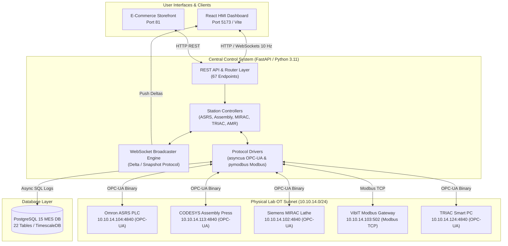

# CoEDM Smart Manufacturing Line — Centralized Control Platform

[](https://python.org)
[](https://fastapi.tiangolo.com)
[](https://postgresql.org)
[](https://reactjs.org)
[](https://vitejs.dev)

> **CoEDM Internship Project — May 2026 | BVM Engineering College, Vallabh Vidyanagar, Gujarat**

---

## What This Is

A full-stack **SCADA / IIoT Centralized Control Platform** for the six-station autonomous manufacturing cell at the **Center of Excellence in Digital Manufacturing (CoEDM)**, BVM Engineering College.

The platform replaces isolated per-machine control software with a single **browser-based HMI** that:
- Streams live sensor data at **10 Hz** via WebSockets using a delta/snapshot protocol
- Issues OPC-UA and Modbus TCP commands to physical PLCs and sensors
- Persists all telemetry, events, and inventory to a **22-table PostgreSQL MES database**
- Provides an end-to-end **e-commerce order → ASRS retrieval** fulfillment pipeline

### System Architecture Overview



---

## Connected Hardware

| Station | Device | Protocol | IP : Port |
|---------|--------|----------|-----------|
| ASRS Robotic Storage | Omron NX102-9000 PLC | OPC-UA | `10.10.14.104:4840` |
| Hydraulic Assembly Press | CODESYS AX-308EA0MA1P | OPC-UA | `10.10.14.113:4840` |
| MIRAC CNC Lathe | Siemens S7-1200 | OPC-UA | `10.10.14.102:4840` |
| MIRAC VibIT Sensors | RS-485 × 3 units via gateway | Modbus TCP | `10.10.14.103:502` |
| TRIAC CNC Mill | Smart PC Controller | OPC-UA | `10.10.14.124:4840` |
| TRIAC VibIT Sensors | RS-485 × 2 units via gateway | Modbus TCP | `10.10.14.129:502` |
| TM Collaborative Robot | TM Robot | Raw TCP/TMSCT | `10.10.14.106:5890` |
| AMR Mobile Robot | Autonomous Mobile Robot | Modbus TCP | `10.10.14.122:502` |

---

## Tech Stack

| Layer | Technology | Version |
|-------|-----------|---------|
| **API Framework** | FastAPI + Uvicorn (ASGI) | 0.110 |
| **OPC-UA Client** | asyncua (sync wrapper) | 1.0.5 |
| **Modbus Client** | pymodbus | 3.6.6 |
| **Database** | PostgreSQL | 15 |
| **ORM / SQL** | SQLAlchemy (`text()` — no ORM models) | 2.0 |
| **Frontend Build** | Vite | 7 |
| **UI Framework** | React | 18 |
| **Animation** | Framer Motion | 11 |
| **Charts** | Recharts | 2 |

---

## Quick Start

```powershell
# Start everything (backend on :8000 + frontend on :5173)
python start.py

# Stop everything
python stop.py

# Run tests (152 passing)
backend\venv\Scripts\python.exe -m pytest backend\tests\ -q

# Diagnose hardware connections
backend\venv\Scripts\python.exe reference\scripts\discovery\modbus_diagnostic.py
```

**Access Points:**
| URL | Description |
|-----|-------------|
| `http://localhost:5173` | React HMI dashboard |
| `http://localhost:8000/docs` | FastAPI Swagger UI (all 67 endpoints) |
| `http://localhost:8000/openapi.json` | OpenAPI JSON spec |

---

## First-Time Setup

```powershell
# 1. Create and activate Python virtualenv
cd backend
python -m venv venv
venv\Scripts\activate

# 2. Install Python dependencies
pip install -r requirements.txt

# 3. Copy and fill in environment variables
copy .env.example .env
# Edit .env: set DATABASE_URL, all hardware IPs

# 4. Initialize the database (run schema)
psql -U <user> -d coedm_db -f database/Integrated_Schema_v2.sql

# 5. Install frontend dependencies
cd ..\frontend
npm install

# 6. Start everything
cd ..
python start.py
```

---

## Repository Layout

```
CoEDM-smart-manufacturing-control/
│
├── README.md                         ← This file
├── start.py / stop.py                ← One-command stack launch/stop
├── pyproject.toml                    ← Python project config
├── docker-compose.yml                ← Docker alternative
│
├── backend/                          ← Python / FastAPI application
│   ├── api/main.py                   ← FastAPI app entry, CORS, router registration
│   ├── api/routes/control/           ← Machine command + WebSocket endpoints
│   ├── api/routes/data/              ← DB read endpoints (inventory, telemetry, events)
│   ├── communication/                ← opcua_driver.py, vibit_modbus.py, modbus_driver.py
│   ├── core/                         ← delta.py, timezone.py (IST utilities)
│   ├── database/                     ← db.py, crud.py, Integrated_Schema_v2.sql
│   ├── stations/                     ← Per-station logic: asrs/, assembly/, mirac/, triac/
│   ├── websockets/                   ← *_broadcaster.py files (one per station)
│   ├── tests/                        ← 152 pytest unit + integration tests
│   ├── requirements.txt
│   └── .env.example
│
├── frontend/                         ← React 18 / Vite 7 SPA
│   └── src/
│       ├── pages/                    ← Dashboard, asrs/, Assembly, Mirac, Triac, etc.
│       ├── components/               ← MiracMachineView, SafetyOverlay, etc.
│       ├── utils/deepMerge.js        ← WS delta merge utility
│       └── styles/tokens.css         ← Dark industrial design tokens
│
├── ecom/                             ← E-Commerce storefront (React/Vite)
│
├── docs/                             ← All documentation (start here)
│   ├── README.md                     ← Documentation index
│   ├── CoEDM_Smart_Manufacturing_Project_Report.md  ← Full academic report
│   ├── USER_MANUAL.md                ← Operator guide
│   ├── HANDOVER.md                   ← ⭐ READ FIRST if you are new to this project
│   ├── CONTRIBUTING.md               ← How to add a new station / modify the system
│   ├── architecture/                 ← 11 SE models (DFD, ERD, State Machine, etc.)
│   ├── api/                          ← REST endpoint reference + schemas
│   └── guides/                       ← Setup, deployment, hardware integration guides
│
├── reference/                        ← Original reference docs, scripts, legacy files
│   ├── docs/                         ← DATA_FLOW.md, NETWORK_TOPOLOGY.md, etc.
│   └── scripts/discovery/            ← modbus_diagnostic.py, network_discovery.py
│
└── scripts/                          ← Utility scripts (make_ecom_admin.py, etc.)
```

---

## Documentation Map

| If you want to… | Read this |
|----------------|-----------|
| Understand the project quickly | [`docs/HANDOVER.md`](docs/HANDOVER.md) |
| Set up the system from scratch | [`docs/guides/setup_and_deployment_guide.md`](docs/guides/setup_and_deployment_guide.md) |
| Add a new station or sensor | [`docs/CONTRIBUTING.md`](docs/CONTRIBUTING.md) |
| Understand the database schema | [`docs/architecture/11_erd.md`](docs/architecture/11_erd.md) |
| Find an API endpoint | [`docs/api/API_README.md`](docs/api/API_README.md) |
| Understand data flow (hardware → browser) | [`reference/docs/DATA_FLOW.md`](reference/docs/DATA_FLOW.md) |
| Diagnose hardware connection issues | [`reference/docs/NETWORK_TOPOLOGY.md`](reference/docs/NETWORK_TOPOLOGY.md) |
| Read the full academic project report | [`docs/CoEDM_Smart_Manufacturing_Project_Report.md`](docs/CoEDM_Smart_Manufacturing_Project_Report.md) |

---

*CoEDM Internship Program | BVM Engineering College, Vallabh Vidyanagar, Anand 388120, Gujarat*
