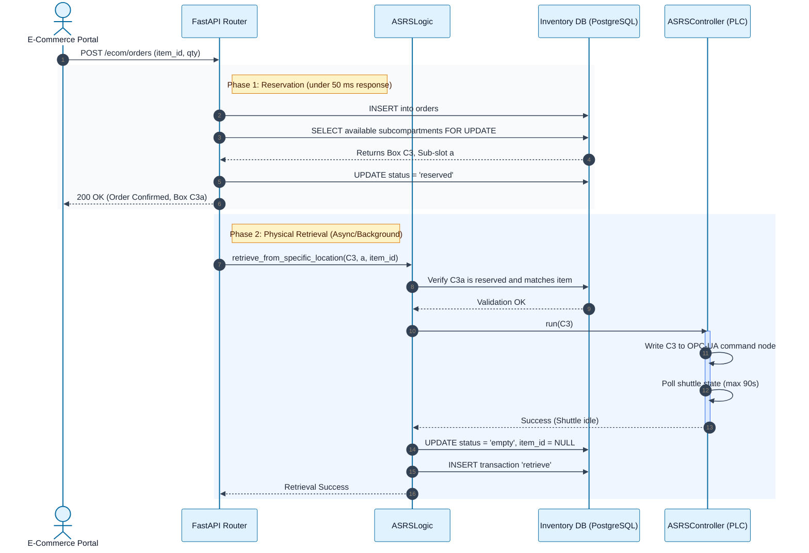

# ASRS Order Fulfillment Sequence

This sequence diagram maps the chronological flow of messages between the external E-Commerce Portal and the internal manufacturing control system during an ASRS item retrieval.

### Key Behaviors Highlighted:
- **Separation of Reservation and Retrieval**: The e-commerce API immediately reserves the item and responds to the portal so the user doesn't wait for the physical robot to move.
- **Row-Level Locking**: `FOR UPDATE SKIP LOCKED` ensures two concurrent orders cannot reserve the same physical sub-compartment.
- **Database Consistency Guarantee**: The `status = 'empty'` update ONLY happens if `ASRSController` returns success.
