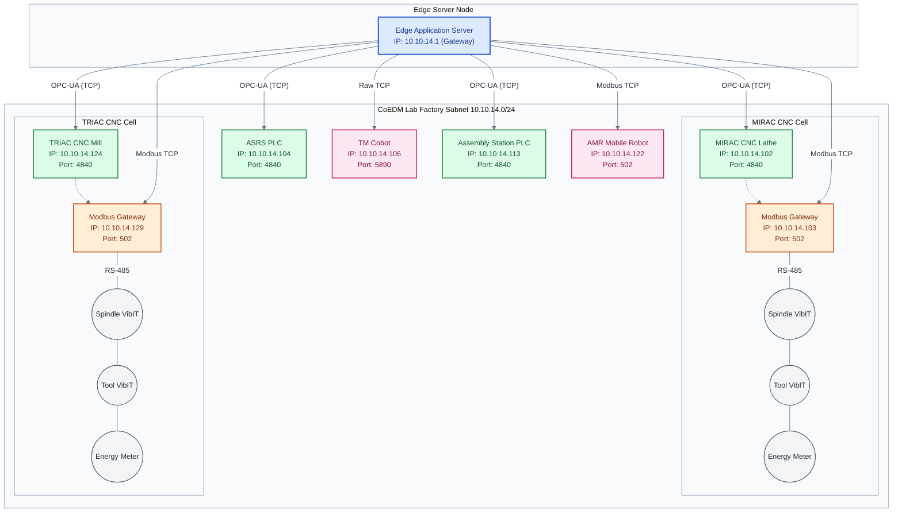

# CoEDM Network Topology

This document details the specific IP addresses, network segments, and communication protocols used across the CoEDM Smart Manufacturing Control System hardware.

## Factory Subnet Map

