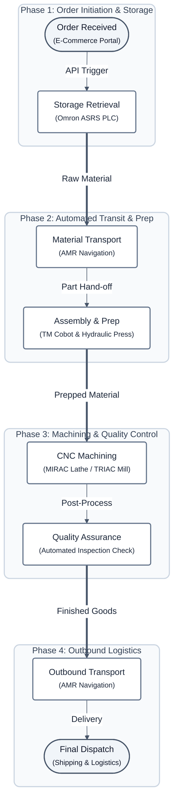

# Manufacturing Workflow: Order-to-Dispatch

This diagram illustrates the sequential end-to-end manufacturing pipeline — tracing the path of a raw material from the moment a customer order is received to its final physical dispatch, routed through the various smart hardware stations in the CoEDM cell.

