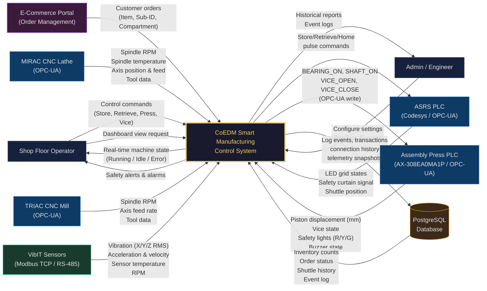

# SE Model 1: Context Diagram (DFD Level 0)
## CoEDM Smart Manufacturing Control System

### Overview
A context diagram (DFD Level 0) defines the system boundary and shows all external entities that interact with the system and the high-level data flows between them.

---

---

## External Entities Description

| Entity | Type | Protocol | Description |
|--------|------|----------|-------------|
| **Shop Floor Operator** | Human Actor | Web UI (HTTP/WS) | Issues control commands, monitors machine states in real time |
| **Admin / Engineer** | Human Actor | Web UI (HTTP/WS) | Views historical logs, configures system settings, reviews reports |
| **ASRS PLC** | Hardware | OPC-UA (`opc.tcp://`) | 5×7 LED grid, shuttle position, safety curtain (35 nodes subscribed) |
| **Assembly Press PLC** | Hardware | OPC-UA (`opc.tcp://`) | AX-308EA0MA1P: displacement, vice state, safety lights, buzzer |
| **MIRAC CNC Lathe** | Hardware | OPC-UA (`opc.tcp://`) | Spindle RPM/temp, X/Z axis position & feed, tool state, LEDs |
| **TRIAC CNC Mill** | Hardware | OPC-UA (`opc.tcp://`) | Spindle RPM, X-axis feed, tool data |
| **VibIT Sensors** | Hardware | Modbus TCP (RS-485 Gateway @ port 502) | X/Y/Z RMS vibration, acceleration, velocity, temperature; shared gateway for all unit IDs |
| **E-Commerce Portal** | External System | REST API (HTTP) | Places customer orders, links items to specific ASRS sub-compartments |
| **PostgreSQL Database** | Data Store | SQLAlchemy / SQL | Persists events, telemetry, inventory, orders, connection history |

---

## Key Data Flows

### Inbound to System (Sensor/Command Data)
- **OPC-UA Subscriptions**: ASRS (100ms poll), Assembly (async read), MIRAC & TRIAC (continuous poll)
- **Modbus TCP Reads**: VibIT sensors polled at ~10 Hz via a single shared TCP gateway connection
- **HTTP POST**: Control commands from the React frontend via REST API endpoints

### Outbound from System (Display/Control)
- **WebSocket Broadcast**: Real-time delta messages sent to all connected frontend clients
- **OPC-UA Writes**: Direct node state writes for assembly control (e.g., `set_node_state()`, `pulse_node()`)
- **PostgreSQL Inserts**: All events, connections, and telemetry snapshots logged with IST timestamps

---

*Next: [DFD Level 1 — Internal Process Decomposition](./02_dfd_level1.md)*

