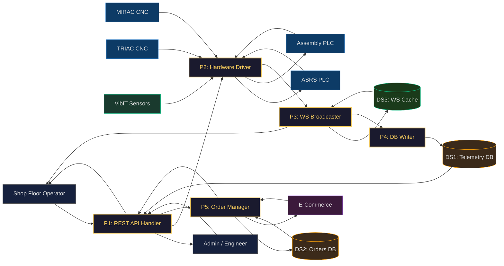

# SE Model 2: Data Flow Diagram (DFD Level 1)
## CoEDM Smart Manufacturing Control System — Internal Process Decomposition

### Overview
DFD Level 1 decomposes the single "CoEDM System" black box from the Context Diagram into its five major internal processes, showing how data flows between them, the external entities, and the data stores.

---

---

## Data Flow Detail

| From | To | Data / Action |
|------|----|---------------|
| Shop Floor Operator | P1 | HTTP POST control command (BEARING_ON, Store A1, etc.) |
| Admin / Engineer | P1 | HTTP GET reports, event logs, machine status |
| P1 | Operator / Admin | HTTP JSON response |
| P1 | P2 | Validated OPC-UA write command |
| P2 | ASRS PLC | OPC-UA write: store / retrieve / home pulse |
| P2 | Assembly PLC | OPC-UA write: BEARING_ON, SHAFT_ON, VICE relay |
| ASRS PLC | P2 | OPC-UA subscription: LED grid (35 nodes), safety curtain |
| Assembly PLC | P2 | OPC-UA poll (10 Hz): displacement, vice, lights, buzzer |
| MIRAC / TRIAC CNC | P2 | OPC-UA poll (10 Hz): spindle, axes, tool data |
| VibIT Sensors | P2 | Modbus TCP (8s): X/Y/Z RMS, peak acc/vel, temp, RPM |
| P2 | P3 | Normalized sensor snapshot |
| P3 | DS3 | Write last broadcast payload (delta cache) |
| DS3 | P3 | Read initial snapshot for new WS client |
| P3 | Operator | WebSocket: snapshot / delta / heartbeat at ~10 Hz |
| P3 | P4 | Telemetry row, connection event, machine alarm |
| P4 | DS1 | INSERT into telemetry, events, connections tables |
| DS1 | P1 | SELECT history for reports |
| E-Commerce | P5 | POST new order (item_id, sub_id, quantity) |
| P5 | DS2 | INSERT/UPDATE orders, order_items, compartments |
| DS2 | P5 | SELECT inventory count, compartment status |
| P5 | E-Commerce | Order confirmation + sub-compartment ID |
| P5 | P1 | Trigger ASRS retrieve command |

---

## Process Descriptions

| Process | Name | Source File(s) | Description |
|---------|------|----------------|-------------|
| **P1** | REST API Handler | `backend/api/routes/control/*/` | Validates incoming HTTP commands from the UI. Routes to the appropriate station controller or order handler. Returns HTTP JSON responses. |
| **P2** | Hardware Driver | `backend/communication/opcua_driver.py`, `vibit_modbus.py` | Manages persistent OPC-UA sessions (one per station) and a shared Modbus TCP gateway for all VibIT sensors. Handles reconnection, health monitoring, and node caching. |
| **P3** | WS Broadcaster | `backend/websockets/*_broadcaster.py` | Reads raw data from P2, builds a normalized JSON payload, computes a delta against the last broadcast, and pushes `snapshot`/`delta`/`heartbeat` messages over WebSocket at ~10 Hz. |
| **P4** | DB Writer | Inside `*_broadcaster.py` (`_log_to_db`, `_log_connection_event_db`) | Writes telemetry rows, machine event logs, and connection records to PostgreSQL asynchronously via `asyncio.to_thread()` to avoid blocking the broadcast loop. |
| **P5** | Order Manager | `backend/api/routes/ecom/`, `backend/stations/asrs/` | Handles the complete e-commerce order lifecycle — creates orders, marks sub-compartments as reserved/occupied, and triggers ASRS retrieve commands when required. |

---

## Data Store Descriptions

| Store | Tables | Purpose |
|-------|--------|---------|
| **DS1** | `machine_events`, `machine_connections`, `mirac_sensor_data`, `triac_sensor_data`, `vibit_readings`, `assembly_station_data` | Historical telemetry and audit trail |
| **DS2** | `orders`, `order_items`, `storage_items`, `storage_boxes`, `storage_compartments` | Inventory and order management |
| **DS3** | `_last_broadcast_payload` (in-memory dict) | WebSocket broadcaster cache for delta computation and initial snapshots |

---

*Previous: [Context Diagram (DFD L0)](./01_context_diagram_dfd_l0.md)*
*Next: [State Machine Diagrams](./03_state_machine_diagrams.md)*
