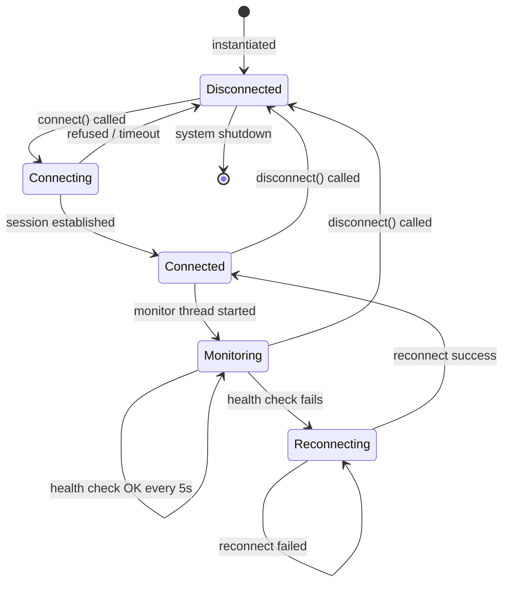
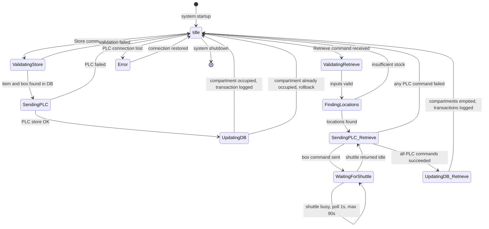
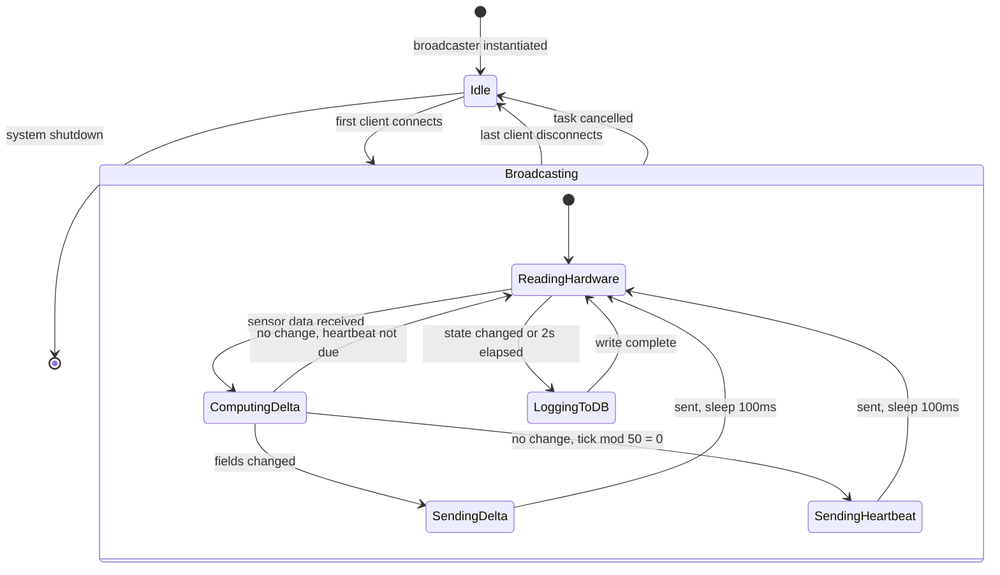

# SE Model 3: State Machine Diagrams (Statecharts)
## CoEDM Smart Manufacturing Control System

### Overview
State machine diagrams show the distinct states each major component can be in and the events/conditions that trigger transitions between states. Three statecharts are documented here, derived directly from the backend source code.

---

## Statechart 1: OPC-UA Connection Manager
*Source: `backend/communication/opcua_driver.py` — `OPCUAConnection` class*

**Key transitions:**
| Event | From | To |
|-------|------|----|
| `connect()` called | Disconnected | Connecting |
| TCP session established | Connecting | Connected |
| Health check fails (every 5s) | Monitoring | Reconnecting |
| `_raw_connect()` succeeds | Reconnecting | Connected |
| `disconnect()` called | Any | Disconnected |
| System shutdown | Disconnected | End |

---

## Statechart 2: ASRS Operation Lifecycle
*Source: `backend/stations/asrs/asrs_logic.py` — `ASRSLogic` class*

**Key states:**
| State | Meaning | Source |
|-------|---------|--------|
| `Idle` | No operation in progress | Initial / after commit |
| `ValidatingStore` | Checking item + box exist in DB | `asrs_logic.py:83` |
| `SendingPLC` | Issuing store pulse `{box_id}S` to PLC | `asrs_logic.py:119` |
| `UpdatingDB` | Marking compartment `occupied`, logging transaction | `asrs_logic.py:139` |
| `WaitingForShuttle` | Polling `get_shuttle_state()` every 1s (max 90s) | `asrs_logic.py:341` |
| `UpdatingDB_Retrieve` | Marking compartments `empty`, logging transactions | `asrs_logic.py:376` |

---

## Statechart 3: WebSocket Broadcaster (per station)
*Source: `backend/websockets/*_broadcaster.py` — `MiracBroadcaster`, `HydraulicBroadcaster`, etc.*

**Key state data:**
| State | `is_broadcasting` | `active_connections` | Trigger |
|-------|------------------|---------------------|---------|
| `Idle` | `False` | empty set | No clients |
| `Broadcasting` | `True` | one or more WS clients | First client connects |

---

*Previous: [DFD Level 1](./02_dfd_level1.md)*
*Next: [Class Diagram](./04_class_diagram.md)*
