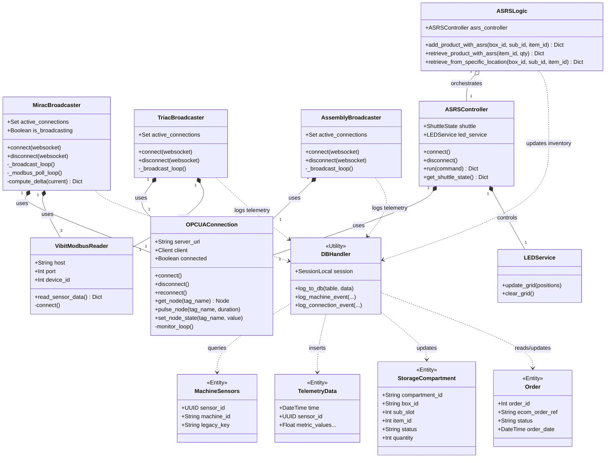

# SE Model 4: Class Diagram
## CoEDM Smart Manufacturing Control System

### Overview
This class diagram illustrates the primary Python classes in the backend application and how they map to physical hardware and database entities. It highlights the separation of concerns between hardware drivers, business logic controllers, WebSocket broadcasters, and data persistence.

---

---

## Component Descriptions

| Component Type | Classes | Responsibility |
|----------------|---------|----------------|
| **Drivers** | `OPCUAConnection`, `VibitModbusReader` | Manage low-level socket connections, reconnections, and protocol-specific reads/writes (OPC-UA and Modbus TCP). |
| **Broadcasters** | `MiracBroadcaster`, `TriacBroadcaster`, `AssemblyBroadcaster` | Maintain active WebSocket clients, poll drivers at 10Hz, compute state deltas, broadcast JSON to UI, and trigger DB writes. |
| **Business Logic** | `ASRSLogic`, `ASRSController`, `LEDService` | Implement complex orchestrations (e.g., ASRS order fulfillment). `ASRSLogic` ensures database updates only occur if PLC commands succeed. |
| **Persistence** | `DBHandler` (SessionLocal), Entity Classes | Handle async writes using `asyncio.to_thread` to prevent DB blocking from stalling the fast WebSocket broadcast loops. |

---

*Previous: [State Machine Diagrams](./03_state_machine_diagrams.md)*
