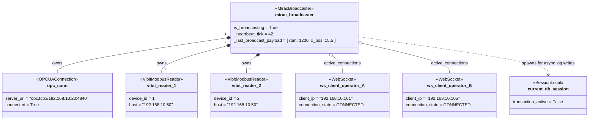
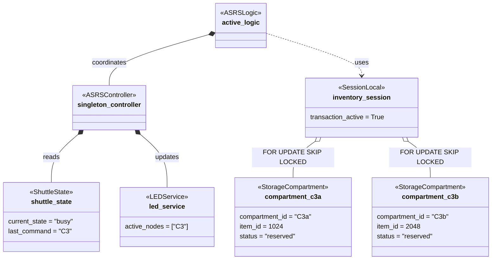

# SE Model 5: Object Diagrams
## CoEDM Smart Manufacturing Control System

### Overview
While a Class Diagram shows the static blueprint of the system, an **Object Diagram** shows a snapshot of the system at runtime. These diagrams illustrate the actual instances in memory at a specific moment in time.

---

## Snapshot 1: MIRAC Station Broadcasting at Runtime
**Scenario**: Two shop floor operators have the MIRAC station dashboard open in their browsers. The system is actively reading sensors and broadcasting data.

### Key Observations:
- There is exactly **one** `MiracBroadcaster` singleton handling the MIRAC station.
- It holds **one** persistent `OPCUAConnection` for PLC data.
- It holds **multiple** `VibitModbusReader` instances, all pointing to the same Modbus gateway IP but different `device_id`s.
- The two connected operators share the exact same `_last_broadcast_payload` cache in memory.

---

## Snapshot 2: ASRS Order Fulfillment Execution
**Scenario**: An E-Commerce order has triggered a retrieval for Box "C3". The ASRS logic has locked the database rows and the shuttle is currently moving to retrieve the box.

### Key Observations:
- The `inventory_session` is holding an active transaction lock (`FOR UPDATE SKIP LOCKED`) on the target sub-compartment records to prevent other concurrent orders from claiming the same items.
- The `shuttle_state` indicates the hardware is physically `busy`.
- The `led_service` has already lit up the LEDs corresponding to Box `C3`.
- Once the shuttle state changes back to `idle`, `active_logic` will commit `inventory_session` and mark the compartments as `empty`.

---

*Previous: [Class Diagram](./04_class_diagram.md)*
