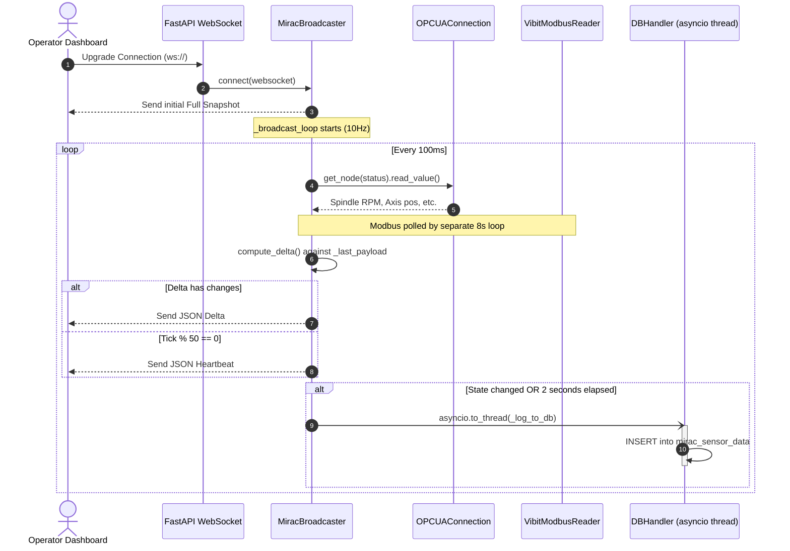

# SE Model 6: Sequence Diagrams
## CoEDM Smart Manufacturing Control System

### Overview
Sequence diagrams map the chronological flow of messages between system components. They are especially useful for visualizing complex asynchronous operations and cross-system orchestration.

---

## Sequence 1: E-Commerce Order Fulfillment (ASRS Retrieval)
**Scenario**: An external E-Commerce Portal submits a new order, which triggers the ASRS system to physically retrieve the item from the warehouse.

```mermaid
sequenceDiagram
    autonumber
    actor Ecom as E-Commerce Portal
    participant API as FastAPI Router
    participant Logic as ASRSLogic
    participant DB as Inventory DB (PostgreSQL)
    participant Ctrl as ASRSController (PLC)
    
    Ecom->>API: POST /ecom/orders (item_id, qty)
    
    rect rgb(30, 40, 50)
    note right of API: Phase 1: Reservation
    API->>DB: INSERT into orders
    API->>DB: SELECT available subcompartments FOR UPDATE
    DB-->>API: Returns Box C3, Sub-slot a
    API->>DB: UPDATE status = 'reserved'
    API-->>Ecom: 200 OK (Order Confirmed, Box C3a)
    end
    
    rect rgb(30, 50, 40)
    note right of API: Phase 2: Physical Retrieval (Async/Background)
    API->>Logic: retrieve_from_specific_location("C3", "a", item_id)
    Logic->>DB: Verify C3a is reserved & matches item
    DB-->>Logic: Validation OK
    
    Logic->>Ctrl: run("C3")
    activate Ctrl
    Ctrl->>Ctrl: Write "C3" to OPC-UA command node
    Ctrl->>Ctrl: Poll shuttle state (max 90s)
    Ctrl-->>Logic: Success (Shuttle idle)
    deactivate Ctrl
    
    Logic->>DB: UPDATE status = 'empty', item_id = NULL
    Logic->>DB: INSERT transaction 'retrieve'
    Logic-->>API: Retrieval Success
    end
```

### Key Behaviors Highlighted:
- **Separation of Reservation and Retrieval**: The e-commerce API immediately reserves the item and responds to the portal so the user doesn't wait for the physical robot to move.
- **Row-Level Locking**: `FOR UPDATE SKIP LOCKED` ensures two concurrent orders cannot reserve the same physical sub-compartment.
- **Database Consistency Guarantee**: The `status = 'empty'` update ONLY happens if `ASRSController` returns success.

---

## Sequence 2: 10Hz WebSocket Telemetry Loop (MIRAC Station)
**Scenario**: A Shop Floor Operator opens the MIRAC dashboard. The system streams physical sensor data to the browser while simultaneously logging it to the database asynchronously.

### Key Behaviors Highlighted:
- **Initial Snapshot**: The UI receives a full state payload immediately upon connecting, eliminating "blank screen" wait times.
- **Delta Compression**: `compute_delta()` ensures the UI only receives data that actually changed, drastically saving WebSocket bandwidth.
- **Non-Blocking IO**: The database write is offloaded to a separate thread (`asyncio.to_thread`) using a fire-and-forget message (`-)`). This guarantees that a slow database insert will never stall the 10Hz physical hardware read loop.

---

*Previous: [Object Diagrams](./05_object_diagram.md)*
