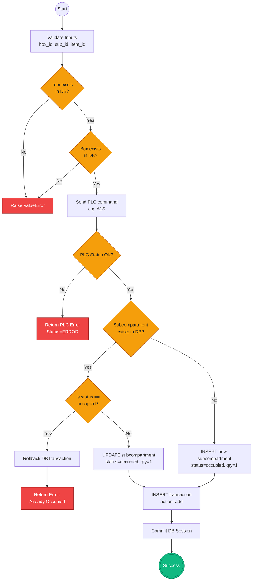

# SE Model 7: Activity Diagrams
## CoEDM Smart Manufacturing Control System

### Overview
Activity diagrams illustrate the step-by-step flow of control within the system, emphasizing decision points, parallel tasks, and alternative paths. They act much like traditional flowcharts but are tailored to software workflows.

---

## Activity 1: ASRS "Store Product" Logic Flow
**Scenario**: The system is instructed to store a product (e.g., a bearing) into a specific sub-compartment. This diagram highlights the critical sequence of database validation *before* commanding the hardware, and the conditional logic used to prevent data corruption.



### Key Business Logic Validations:
1. **Safety First**: The physical PLC command is executed *before* committing the database changes. If the robotic arm fails to move, the database remains completely unchanged, preventing "phantom" inventory.
2. **Double Occupancy Prevention**: Even if the PLC successfully places the item, if the database thinks the slot is already occupied, the transaction rolls back, acting as a final safeguard against database inconsistency.

---

## Activity 2: OPC-UA Health Monitor & Reconnect Flow
**Scenario**: The background thread responsible for ensuring the system stays connected to the machine PLCs. This loop runs constantly while the server is alive.

```mermaid
flowchart TD
    Start((Start Monitor<br/>Thread)) --> Sleep[Sleep 5 seconds]
    
    Sleep --> IsConn{self.connected<br/>== True?}
    IsConn -- No --> Sleep
    
    IsConn -- Yes --> Lock[Acquire Lock]
    Lock --> CheckClient{Client object<br/>exists?}
    CheckClient -- No --> Release1[Release Lock]
    Release1 --> Sleep
    
    CheckClient -- Yes --> ReadHealth[Read OPC-UA Node<br/>ns=0;i=2259]
    ReadHealth --> CheckHealth{Read<br/>Successful?}
    
    CheckHealth -- Yes --> Release2[Release Lock]
    Release2 --> Sleep
    
    CheckHealth -- No --> Release3[Release Lock]
    Release3 --> LogWarn[Log Warning:<br/>Connection Lost]
    
    LogWarn --> ReconnectCall[Call reconnect()]
    ReconnectCall --> RawDisconnect[Raw Disconnect<br/>destroy socket]
    RawDisconnect --> RawConnect[Raw Connect<br/>new client]
    
    RawConnect --> ReconnStatus{Connect<br/>Success?}
    ReconnStatus -- No --> LogErr[Log Error:<br/>Auto-reconnect failed]
    LogErr --> Sleep
    
    ReconnStatus -- Yes --> FireCallbacks[Fire Reconnect Callbacks<br/>1. Clear Node Cache<br/>2. Re-subscribe LEDs]
    FireCallbacks --> Sleep
    
    %% Styling
    classDef decision fill:#f59e0b,stroke:#b45309,color:#1e1e1e
    classDef error fill:#ef4444,stroke:#991b1b,color:#fff
    classDef success fill:#10b981,stroke:#047857,color:#fff
    
    class IsConn,CheckClient,CheckHealth,ReconnStatus decision
    class LogWarn,LogErr error
    class FireCallbacks success
```

### Key Resilience Features:
- **Lock Governance**: To prevent thread collisions between the heartbeat monitor and an operator issuing a command, operations are wrapped in `self._lock`.
- **Stateless Reconnection**: When a socket drops, `Raw Connect` creates a brand new `Client` object rather than trying to reuse a potentially corrupted one.
- **Callback Propagation**: A successful reconnection triggers callbacks (like clearing the `_plc_node_cache` inside the Broadcasters) to ensure stale memory references don't poison the new session.

---

*Previous: [Sequence Diagrams](./06_sequence_diagrams.md)*
