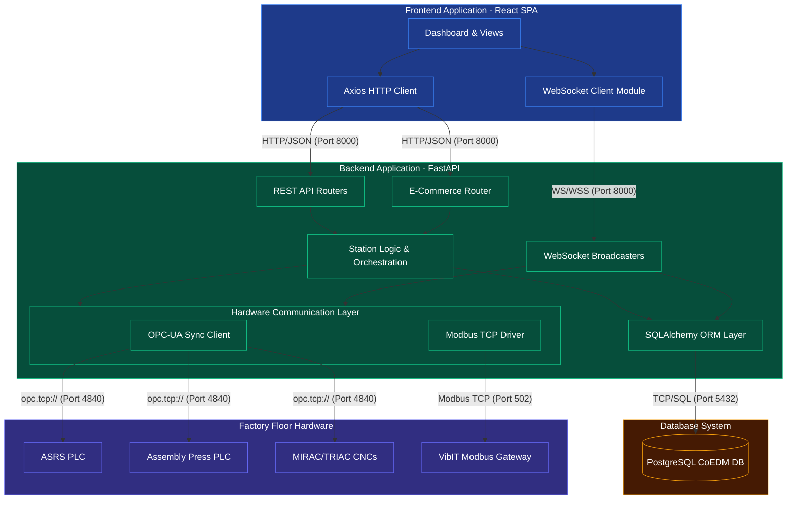

# SE Model 8: Component Diagram
## CoEDM Smart Manufacturing Control System

### Overview
The Component Diagram provides a high-level, structural view of the system's modular architecture. It illustrates how the software is divided into interchangeable components, the interfaces they expose, and their dependencies. This is crucial for Knowledge Transfer (KT) as it defines the boundaries of responsibility for each module in the codebase.

---

## System Components

---

## In-Depth Component Analysis for Knowledge Transfer

### 1. Frontend Application (React SPA)
The frontend is built as a single-page application (SPA) using React and Vite. It is strictly a presentation layer and holds no persistent state or hardware connection logic.
*   **Dashboard & Views**: Composed of reusable React components (`FactoryLayout`, `Assembly`, `Dashboard`). Responsible for rendering the SVG/Canvas layouts, UI buttons, and charts.
*   **WebSocket Client**: A custom hook/manager that maintains a persistent connection to the backend. It receives 10Hz delta JSON payloads and patches them onto the local React state, causing immediate re-renders of the gauges and dials.
*   **HTTP Client**: Uses Axios to issue discrete, one-off commands (e.g., `POST /control/assembly/bearing_on`, `GET /reports/telemetry`).

### 2. Backend Application (FastAPI)
The backend is the brain of the CoEDM system. It is heavily modularized to separate hardware polling from web request handling.
*   **REST API & E-Commerce Routers**: Located in `backend/api/routes/`. These components expose the standard HTTP endpoints. They perform input validation and immediately delegate the actual work to the `Station Logic` module. The E-Commerce router specifically handles external integration for order placements.
*   **WebSocket Broadcasters**: Located in `backend/websockets/`. These act as bridges. They run infinite asynchronous loops that pull data from the `Communication Layer`, compress it into JSON deltas, and push it to connected clients. Crucially, they also spawn background threads to pipe this telemetry into the `DB Layer` without blocking the fast 10Hz read cycle.
*   **Station Logic & Orchestration**: Located in `backend/stations/`. This is where complex business rules live. For example, `ASRSLogic` ensures that an item is successfully fetched by the PLC *before* marking its database slot as empty. It coordinates between the DB Layer and the Hardware Drivers.
*   **Hardware Communication Layer**: Located in `backend/communication/`.
    *   **OPC-UA Sync Client**: Wraps `asyncua.sync`. Maintains a persistent, auto-reconnecting session with the PLCs. It caches node references and abstracts away the complexities of the `opc.tcp://` protocol.
    *   **Modbus TCP Driver**: Wraps `pymodbus`. Acts as a client to the VibIT RS-485-to-Ethernet gateway. Due to Modbus serial constraints, it is polled at a slower rate (e.g., 8 seconds) compared to OPC-UA (100ms).

### 3. Database Layer (PostgreSQL & SQLAlchemy)
The persistence component ensures ACID compliance for inventory and historical record-keeping.
*   **SQLAlchemy ORM (`backend/database/`)**: Provides session management (`SessionLocal`). It uses row-level locking (`FOR UPDATE SKIP LOCKED`) to ensure concurrent operations (like two simultaneous e-commerce orders) do not corrupt the ASRS inventory state.

### 4. Physical Hardware Environment
These are external components that the software controls and monitors.
*   **PLCs**: Industrial controllers running Codesys. They expose OPC-UA servers on port `4840`. They act as the absolute source of truth for the physical machine state (e.g., piston displacement, spindle RPM).
*   **VibIT Gateway**: A transparent gateway that converts TCP packets on port `502` into RS-485 serial requests for the daisy-chained vibration sensors.

---
*Previous: [Activity Diagrams](./07_activity_diagrams.md)*
*Next: [Deployment Diagram](./09_deployment_diagram.md)*
