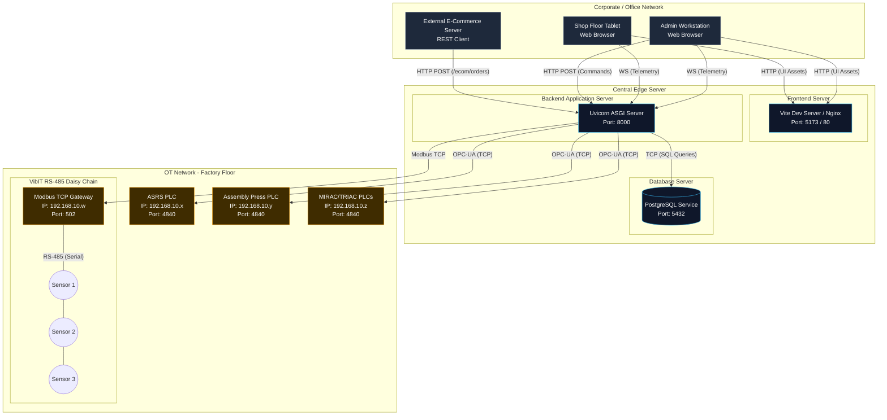

# SE Model 9: Deployment Diagram
## CoEDM Smart Manufacturing Control System

### Overview
The Deployment Diagram models the physical (or virtual) architecture of the system. It illustrates how the compiled software artifacts are deployed onto physical nodes (servers, operator workstations, factory hardware) and details the network topologies, protocols, and port numbers connecting them.

---

## Physical Architecture & Network Topology

---

## Deployment Deep Dive for Knowledge Transfer

### 1. Network Segmentation
The deployment relies on strict network separation to ensure security and performance:
*   **Corporate/IT Network**: This is where the Admin PCs, tablets, and external e-commerce servers live. They do *not* have direct access to the PLCs.
*   **OT (Operational Technology) Network**: This is the restricted factory floor network (e.g., `192.168.10.x`). Only the Central Edge Server is permitted to route traffic into this subnet. This prevents external actors from directly communicating with industrial machinery.

### 2. Node Explanations

#### A. Central Edge Server
This is the main compute node (currently running as `localhost` in development). In a production environment, this would be an industrial PC or a secure server on the factory floor.
*   **Frontend Server**: Serves the static compiled HTML/JS/CSS bundles to client browsers. In development, this is the Vite Dev Server (`npm run dev` on port 5173). In production, these files would be served via Nginx or Apache on port 80/443.
*   **Backend Application Server**: Runs the FastAPI application via Uvicorn. Bound to port `8000`. This process is highly asynchronous and CPU-bound, handling multiple WebSocket connections and concurrent OPC-UA polling threads.
*   **Database Server**: The PostgreSQL database engine. Runs as a persistent background service on port `5432`. It stores all historical state, meaning the Backend Server is effectively stateless and can be restarted without losing critical inventory data.

#### B. The Factory Hardware
The edge server acts as the master to these slave devices.
*   **OPC-UA Endpoints**: Each machine (ASRS, Assembly, MIRAC, TRIAC) contains a PLC running an embedded OPC-UA server on the standard port `4840`. The backend maintains persistent TCP sockets to these ports.
*   **VibIT Sensor Topology**: The vibration sensors do not have individual IP addresses. They are daisy-chained via an RS-485 serial cable. A single **Modbus TCP Gateway** sits on the network, exposing port `502`. The backend sends TCP packets to the Gateway, which translates them into serial pulses down the wire to poll Sensor 1, 2, and 3 sequentially.

### 3. Connection Protocols & Security
*   **HTTP / WS (Client to Server)**: All traffic from the user interface travels over standard HTTP and WebSockets.
*   **OPC-UA TCP (Server to Machine)**: A binary protocol (`opc.tcp://`) is used over the OT network for ultra-low latency. Because it is binary, it is highly efficient, allowing the server to read hundreds of data points per second without bandwidth saturation.
*   **SQL/TCP (Server to DB)**: Communication with PostgreSQL happens over its native wire protocol, utilizing a connection pool (managed by SQLAlchemy) to prevent port exhaustion during heavy telemetry logging.

---
*Previous: [Component Diagram](./08_component_diagram.md)*
*Next: [Use Case Diagram](./10_use_case_diagram.md)*
