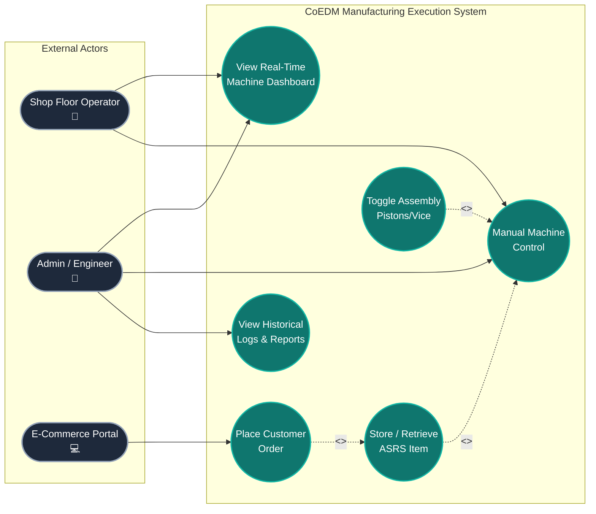

# SE Model 10: Use Case Diagram
## CoEDM Smart Manufacturing Control System

### Overview
The Use Case Diagram describes the system's functionality from the perspective of its external users (actors). It outlines *what* the system does for each actor without detailing *how* it does it. This is essential for understanding the primary workflows and permissions built into the application.

---

## Use Case Model

---

## Use Case Descriptions & Knowledge Transfer

### Actors Defined
1. **Shop Floor Operator**: The primary human user on the factory floor. Needs immediate, low-latency access to machine states and the ability to issue override/manual commands to keep production moving.
2. **Admin / Engineer**: A privileged user responsible for system maintenance, auditing, and quality control. They require access to historical data (telemetry logs, event trails) to diagnose past issues.
3. **E-Commerce Portal**: An external automated system representing customer purchases. It interacts solely with the REST API to trigger physical fulfillment workflows.

### Core Use Case Deep Dives

#### UC1: View Real-Time Machine Dashboard
*   **Primary Actors**: Operator, Admin
*   **Description**: The user opens the React web interface and views 10Hz streaming telemetry data (gauges, charts, LED grids, 3D representations).
*   **System Response**: The system opens a WebSocket connection and continuously pushes delta JSON payloads. The UI renders this data without page reloads.

#### UC2: Manual Machine Control
*   **Primary Actors**: Operator, Admin
*   **Description**: The user needs to manually actuate a physical machine part for testing, alignment, or manual production runs.
*   **Extensions**:
    *   `UC3 (Store / Retrieve ASRS Item)`: The operator types "A1" into the UI to force the robotic shuttle to move to a specific slot.
    *   `UC4 (Toggle Assembly Pistons)`: The operator clicks "Bearing On" to fire the pneumatic piston on the Assembly station.

#### UC5: View Historical Logs & Reports
*   **Primary Actor**: Admin
*   **Description**: The Admin queries past machine events (e.g., "When did the MIRAC spindle temperature exceed 45°C?").
*   **System Response**: The system queries the PostgreSQL `machine_events` and `vibit_readings` tables, returning JSON arrays that the frontend parses into audit tables or historical line charts.

#### UC6: Place Customer Order
*   **Primary Actor**: E-Commerce Portal
*   **Description**: A customer buys a product online. The external portal sends a `POST /ecom/orders` request to the system.
*   **Includes `UC3`**: Fulfilling a customer order *mandatorily includes* retrieving the item from the ASRS. The system automatically reserves the database compartment, replies to the E-Commerce portal, and commands the ASRS PLC to physically fetch the box.

---
*Previous: [Deployment Diagram](./09_deployment_diagram.md)*
*Next: [ERD — Database Schema](./11_erd.md)*
