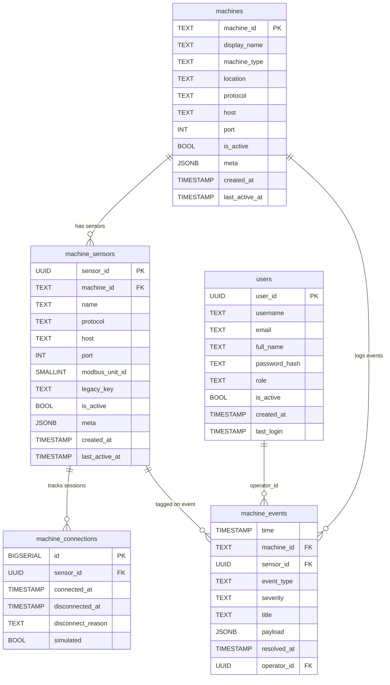
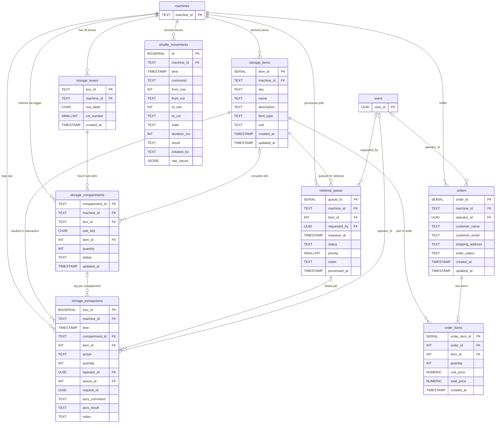
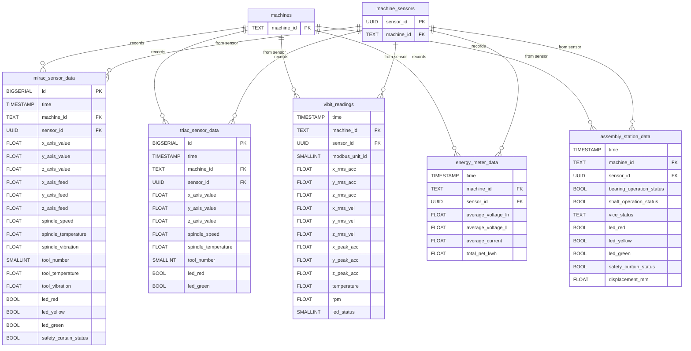
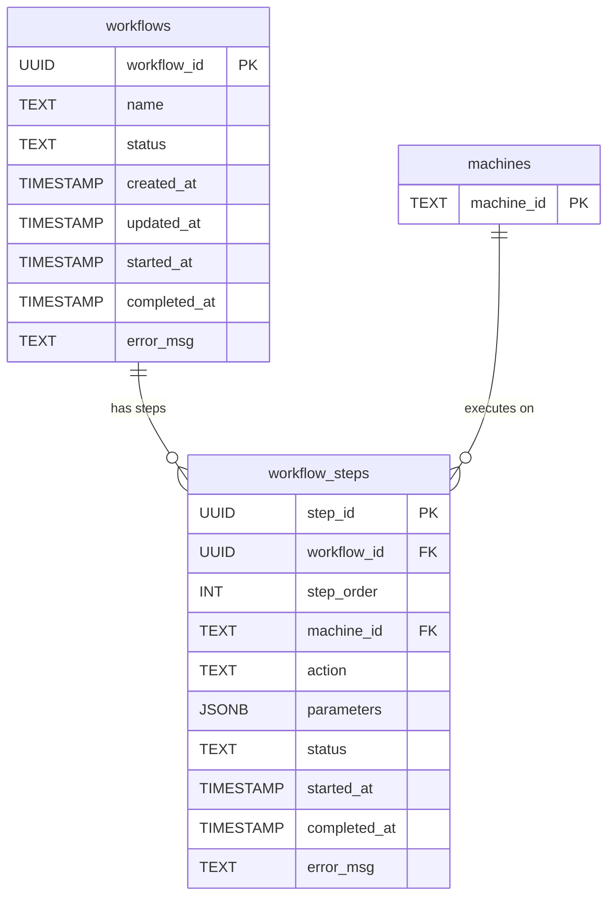

# SE Model 11: Entity-Relationship Diagram (ERD)
## CoEDM Smart Manufacturing Control System — Database Schema v2

### Overview
This ERD is derived directly from `backend/database/Integrated_Schema_v2.sql`. It documents all 20+ tables, their columns, primary/foreign keys, and the relationships between them. The schema is structured around a single root table (`machines`) from which all other tables derive their identity.

---

## Database Architecture Philosophy
The schema follows a strict **hub-and-spoke** pattern anchored on the `machines` table:
- Every significant table carries a `machine_id TEXT FK → machines(machine_id)` column.
- Telemetry tables additionally carry a `sensor_id UUID FK → machine_sensors(sensor_id)`.
- This means any data row anywhere in the database can always be traced back to the specific physical machine that produced it.

---

## ERD — Domain 1: Machine Registry (Core)

---

## ERD — Domain 2: ASRS Inventory & Fulfillment

---

## ERD — Domain 3: Telemetry Time-Series

---

## ERD — Domain 4: Workflow Engine (Future)

---

## Table Reference

| # | Table | Domain | Key Relationships |
|---|-------|--------|-------------------|
| 1 | `machines` | Core | Root table. All FKs trace back here. |
| 2 | `machine_sensors` | Core | Child of `machines`. Root for all telemetry. |
| 3 | `users` | Core | Referenced by events, orders, transactions. |
| 4 | `machine_events` | Core | Event log → `machines` + `machine_sensors` + `users`. |
| 5 | `machine_connections` | Core | OPC-UA session history → `machine_sensors`. |
| 6 | `storage_items` | ASRS | Item master catalog → `machines (asrs)`. |
| 7 | `storage_boxes` | ASRS | 35 grid boxes → `machines (asrs)`. `box_id` auto-computed by trigger. |
| 8 | `storage_compartments` | ASRS | 210 sub-slots → `storage_boxes` + `storage_items`. `compartment_id` auto-computed by trigger. |
| 9 | `retrieval_queue` | ASRS | Pending FIFO jobs → `storage_items` + `users`. |
| 10 | `storage_transactions` | ASRS | Append-only audit log. Never updated/deleted. |
| 11 | `shuttle_movements` | ASRS | Physical shuttle history. Latest row = current state. |
| 12 | `orders` | E-Commerce | Customer orders → `machines (asrs)` + `users`. |
| 13 | `order_items` | E-Commerce | Line items → `orders` + `storage_items`. `total_price` is GENERATED STORED. |
| 14 | `mirac_sensor_data` | Telemetry | 10Hz CNC Lathe time-series. |
| 15 | `triac_sensor_data` | Telemetry | 10Hz CNC Mill time-series (mirrors MIRAC). |
| 16 | `vibit_readings` | Telemetry | 8s Modbus vibration time-series. |
| 17 | `energy_meter_data` | Telemetry | Energy meter time-series. |
| 18 | `assembly_station_data` | Telemetry | Assembly PLC time-series. |
| 19 | `amr_sensor_data` | Placeholder | AMR position/navigation (future). |
| 20 | `cobot_sensor_data` | Placeholder | TM Cobot joint/TCP data (future). |
| 21 | `workflows` | Workflow Engine | Multi-machine workflow definitions (future). |
| 22 | `workflow_steps` | Workflow Engine | Individual steps per workflow (future). |

---

## Critical Design Notes for KT

### Trigger-Computed Primary Keys
Two tables have their PKs computed automatically by PostgreSQL `BEFORE INSERT` triggers, **not** by the application:
- `storage_boxes.box_id` = `row_label || col_number::TEXT` → e.g., `"A3"`
- `storage_compartments.compartment_id` = `box_id || sub_slot` → e.g., `"A3b"`

**⚠ Implication for developers**: Never manually set these PKs. Always let the trigger run. If you INSERT with a specific `box_id`, the trigger will **overwrite** it.

### `modbus_unit_id` Is NOT a Foreign Key
`vibit_readings.modbus_unit_id` is an **informational copy** of the Modbus slave address. It does not foreign-key reference `machine_sensors.modbus_unit_id` because that column is **not unique** (multiple unit IDs can share a gateway). The sensor is identified solely through `sensor_id (UUID)`.

### Append-Only Tables
`storage_transactions` is strictly append-only. No application code should ever `UPDATE` or `DELETE` from it. It is the audit trail of all physical ASRS movements.

### Operational Views
The schema ships with 4 views for convenience:
| View | Purpose |
|------|---------|
| `v_machine_status` | Live overview of all machines: sensor count, latest unresolved event |
| `v_shuttle_state` | Latest `shuttle_movements` row per machine = current physical state of the ASRS arm |
| `v_asrs_inventory` | Compartment map joined with item details. Filter `status = 'occupied'` for inventory |
| `v_active_sensors` | Active sensors with full machine context |

---

*Previous: [Use Case Diagram](./10_use_case_diagram.md)*
