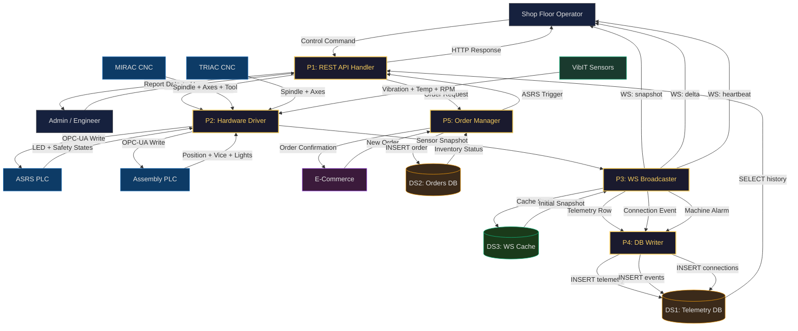

# SE Model 2: Data Flow Diagram (DFD Level 1)
## CoEDM Smart Manufacturing Control System — Internal Process Decomposition

### Overview
DFD Level 1 decomposes the single "CoEDM System" black box from the Context Diagram into its five major internal processes, showing how data flows between them, the external entities, and the data stores.

---

---

## Process Descriptions

| Process | Name | Source File(s) | Description |
|---------|------|----------------|-------------|
| **P1** | REST API Handler | `backend/api/routes/control/*/` | Validates incoming HTTP commands from the UI. Routes to the appropriate station controller or order handler. Returns HTTP JSON responses. |
| **P2** | Hardware Driver | `backend/communication/opcua_driver.py`, `vibit_modbus.py` | Manages persistent OPC-UA sessions (one per station) and a shared Modbus TCP gateway for all VibIT sensors. Handles reconnection, health monitoring, and node caching. |
| **P3** | WS Broadcaster | `backend/websockets/*_broadcaster.py` | Reads raw data from P2, builds a normalized JSON payload, computes a delta against the last broadcast, and pushes `snapshot`/`delta`/`heartbeat` messages over WebSocket at ~10 Hz. |
| **P4** | DB Writer | Inside `*_broadcaster.py` (`_log_to_db`, `_log_connection_event_db`) | Writes telemetry rows, machine event logs, and connection records to PostgreSQL asynchronously via `asyncio.to_thread()` to avoid blocking the broadcast loop. |
| **P5** | Order Manager | `backend/api/routes/ecom/`, `backend/stations/asrs/` | Handles the complete e-commerce order lifecycle — creates orders, marks sub-compartments as reserved/occupied, and triggers ASRS retrieve commands when required. |

---

## Data Store Descriptions

| Store | Tables | Purpose |
|-------|--------|---------|
| **DS1** | `machine_events`, `machine_connections`, `mirac_sensor_data`, `triac_sensor_data`, `vibit_readings`, `assembly_station_data` | Historical telemetry and audit trail |
| **DS2** | `orders`, `order_items`, `storage_items`, `storage_boxes`, `storage_compartments` | Inventory and order management |
| **DS3** | `_last_broadcast_payload` (in-memory dict) | WebSocket broadcaster cache for delta computation and initial snapshots |

---

## Key Design Decisions

1. **Dual polling rates**: P2 polls OPC-UA at **10 Hz** but VibIT Modbus at **8s intervals** (separate asyncio task) to prevent slow RS-485 reads blocking axis position updates.
2. **Delta compression**: P3 uses `compute_delta()` to only transmit changed fields, minimizing WebSocket bandwidth.
3. **Last-good cache**: P3 maintains a `_last_good_vibit*` cache so the frontend always shows the most recent valid reading when sensors drop temporarily.
4. **Non-blocking DB writes**: All P4 writes use `asyncio.to_thread()` keeping the broadcast loop at full speed.

---

*Previous: [Context Diagram (DFD L0)](./01_context_diagram_dfd_l0.md)*
*Next: [State Machine Diagrams](./03_state_machine_diagrams.md)*
