```mermaid
graph TD
    %% ─────────────────────────────────────────
    %% External Entities
    %% ─────────────────────────────────────────
    OP["Shop Floor Operator"]
    ADMIN["Admin / Engineer"]
    ASRS_HW["ASRS PLC\n(OPC-UA)"]
    ASSEMBLY_HW["Assembly Press PLC\n(OPC-UA)"]
    MIRAC_HW["MIRAC CNC Lathe\n(OPC-UA)"]
    TRIAC_HW["TRIAC CNC Mill\n(OPC-UA)"]
    VIBIT["VibIT Sensors\n(Modbus TCP)"]
    ECOM["E-Commerce Portal"]

    %% ─────────────────────────────────────────
    %% Data Stores
    %% ─────────────────────────────────────────
    DS1[("DS1: PostgreSQL\nmachine_events\nmachine_connections\ntelemetry tables")]
    DS2[("DS2: PostgreSQL\norders / order_items\nstorage_items\nstorage_compartments")]
    DS3[("DS3: In-Memory\nBroadcaster State\n_last_broadcast_payload")]

    %% ─────────────────────────────────────────
    %% Internal Processes
    %% ─────────────────────────────────────────
    P1["P1\nHandle REST API\nRequests\n(FastAPI Routers)"]
    P2["P2\nAcquire Hardware\nData\n(OPC-UA + Modbus Drivers)"]
    P3["P3\nProcess and\nBroadcast Data\n(Station Broadcasters)"]
    P4["P4\nPersist Telemetry\nand Events\n(DB Write Layer)"]
    P5["P5\nManage Orders\nand Inventory\n(E-Com / ASRS Module)"]

    %% ─────────────────────────────────────────
    %% Operator / Admin -> P1
    %% ─────────────────────────────────────────
    OP -- "HTTP POST: Control command\n(BEARING_ON, SHAFT_ON,\n VICE_OPEN, Store A1S, etc.)" --> P1
    ADMIN -- "HTTP GET: Reports,\nevent logs, machine status" --> P1

    %% ─────────────────────────────────────────
    %% P1 -> Hardware (control path)
    %% ─────────────────────────────────────────
    P1 -- "Validated command\n(tag name + value)" --> P2
    P2 -- "OPC-UA Write:\nset_node_state(tag, True)\npulse_node(tag)" --> ASRS_HW
    P2 -- "OPC-UA Write:\nBEARING_ON / SHAFT_ON\nVICE RELAY" --> ASSEMBLY_HW

    %% ─────────────────────────────────────────
    %% P1 -> P5 (order management)
    %% ─────────────────────────────────────────
    P1 -- "Order request\n(item_id, quantity,\n compartment)" --> P5

    %% ─────────────────────────────────────────
    %% P1 -> Client (REST responses)
    %% ─────────────────────────────────────────
    P1 -- "HTTP Response:\n{success, message}" --> OP
    P1 -- "HTTP Response:\njson report / event list" --> ADMIN

    %% ─────────────────────────────────────────
    %% Hardware -> P2 (sensor data ingestion)
    %% ─────────────────────────────────────────
    ASRS_HW -- "OPC-UA Subscription:\nLED grid (35 nodes)\nSafety curtain node" --> P2
    ASSEMBLY_HW -- "OPC-UA Poll (10 Hz):\ndisplacement_mm, vice, lights, buzzer" --> P2
    MIRAC_HW -- "OPC-UA Poll (10 Hz):\nspindle, axes, tool, LEDs" --> P2
    TRIAC_HW -- "OPC-UA Poll (10 Hz):\nspindle, axes, tool" --> P2
    VIBIT -- "Modbus TCP (8s cycle):\nX/Y/Z RMS + Peak Acc/Vel\ntemperature, RPM, kWh" --> P2

    %% ─────────────────────────────────────────
    %% P2 -> P3 (pass raw data to broadcaster)
    %% ─────────────────────────────────────────
    P2 -- "Raw sensor snapshot\n{plc_data, vibit1, vibit2,\n vibit3, energy_meter}" --> P3

    %% ─────────────────────────────────────────
    %% P3 -> DS3 (cache last broadcast payload)
    %% ─────────────────────────────────────────
    P3 -- "Write: _last_broadcast_payload" --> DS3
    DS3 -- "Read: send initial snapshot\nto new WS client" --> P3

    %% ─────────────────────────────────────────
    %% P3 -> Client (WebSocket streaming)
    %% ─────────────────────────────────────────
    P3 -- "WS: type=snapshot\n(full state, first connect)" --> OP
    P3 -- "WS: type=delta\n(changed fields only, ~10 Hz)" --> OP
    P3 -- "WS: type=heartbeat\n(keepalive every 5s)" --> OP

    %% ─────────────────────────────────────────
    %% P3 -> P4 (trigger DB writes)
    %% ─────────────────────────────────────────
    P3 -- "Telemetry snapshot\n(on state change or 2s heartbeat)" --> P4
    P3 -- "Connection event\n(connected=True/False)" --> P4
    P3 -- "Machine event\n(alarm / info)" --> P4

    %% ─────────────────────────────────────────
    %% P4 -> DS1 (persistence)
    %% ─────────────────────────────────────────
    P4 -- "INSERT: mirac_sensor_data\ntriac_sensor_data\nvibit_readings\nassembly_station_data\nenergy_meter_data" --> DS1
    P4 -- "INSERT: machine_events\n(safety curtain, red LED, etc.)" --> DS1
    P4 -- "INSERT/UPDATE:\nmachine_connections\n(connect / disconnect log)" --> DS1

    %% ─────────────────────────────────────────
    %% DS1 -> P1 (read back for reports)
    %% ─────────────────────────────────────────
    DS1 -- "SELECT: event list\ntelemetry history\nconnection uptime" --> P1

    %% ─────────────────────────────────────────
    %% E-Com -> P5 -> DS2
    %% ─────────────────────────────────────────
    ECOM -- "POST: New order\n(item_id, sub_id, qty)" --> P5
    P5 -- "INSERT/UPDATE:\norders, order_items\nstorage_compartments" --> DS2
    DS2 -- "SELECT: inventory count\ncompartment status\norder status" --> P5
    P5 -- "Order confirmation\n+ sub-compartment ID" --> ECOM
    P5 -- "Trigger ASRS command\n(Retrieve box)" --> P1

    %% ─────────────────────────────────────────
    %% Styling
    %% ─────────────────────────────────────────
    style P1 fill:#1a1a2e,color:#f5cb5c,stroke:#f5cb5c,stroke-width:2px
    style P2 fill:#1a1a2e,color:#f5cb5c,stroke:#f5cb5c,stroke-width:2px
    style P3 fill:#1a1a2e,color:#f5cb5c,stroke:#f5cb5c,stroke-width:2px
    style P4 fill:#1a1a2e,color:#f5cb5c,stroke:#f5cb5c,stroke-width:2px
    style P5 fill:#1a1a2e,color:#f5cb5c,stroke:#f5cb5c,stroke-width:2px

    style DS1 fill:#3b2a1a,color:#e0e0e0,stroke:#f59e0b,stroke-width:1px
    style DS2 fill:#3b2a1a,color:#e0e0e0,stroke:#f59e0b,stroke-width:1px
    style DS3 fill:#1a3a1a,color:#e0e0e0,stroke:#10b981,stroke-width:1px

    style OP fill:#16213e,color:#e0e0e0,stroke:#555,stroke-width:1px
    style ADMIN fill:#16213e,color:#e0e0e0,stroke:#555,stroke-width:1px
    style ASRS_HW fill:#0d3b66,color:#e0e0e0,stroke:#2a7cc7,stroke-width:1px
    style ASSEMBLY_HW fill:#0d3b66,color:#e0e0e0,stroke:#2a7cc7,stroke-width:1px
    style MIRAC_HW fill:#0d3b66,color:#e0e0e0,stroke:#2a7cc7,stroke-width:1px
    style TRIAC_HW fill:#0d3b66,color:#e0e0e0,stroke:#2a7cc7,stroke-width:1px
    style VIBIT fill:#1a3a2e,color:#e0e0e0,stroke:#10b981,stroke-width:1px
    style ECOM fill:#3b1a3b,color:#e0e0e0,stroke:#a855f7,stroke-width:1px
```

# SE Model 2: Data Flow Diagram (DFD Level 1)
## CoEDM Smart Manufacturing Control System — Internal Process Decomposition

### Overview
DFD Level 1 decomposes the single "CoEDM System" black box from the Context Diagram into its five major internal processes, showing how data flows between them, the external entities, and the data stores.

---

---

## Process Descriptions

| Process | Name | Source File(s) | Description |
|---------|------|----------------|-------------|
| **P1** | Handle REST API Requests | `backend/api/routes/control/*/` | Validates incoming HTTP commands from the UI. Routes to the appropriate station controller or order handler. Returns HTTP JSON responses. |
| **P2** | Acquire Hardware Data | `backend/communication/opcua_driver.py`, `vibit_modbus.py` | Manages persistent OPC-UA sessions (one per station) and a shared Modbus TCP gateway for all VibIT sensors. Handles reconnection, health monitoring, and node caching. |
| **P3** | Process and Broadcast Data | `backend/websockets/*_broadcaster.py` | Reads raw data from P2, builds a normalized JSON payload, computes a delta against the last broadcast, and pushes `snapshot`/`delta`/`heartbeat` messages over WebSocket at ~10 Hz. |
| **P4** | Persist Telemetry and Events | Inside `*_broadcaster.py` (`_log_to_db`, `_log_connection_event_db`, `_log_machine_event_db`) | Writes telemetry rows, machine event logs, and connection records to PostgreSQL asynchronously via `asyncio.to_thread()` to avoid blocking the broadcast loop. |
| **P5** | Manage Orders and Inventory | `backend/api/routes/ecom/`, `backend/stations/asrs/` | Handles the complete e-commerce order lifecycle — creates orders, marks sub-compartments as reserved/occupied, and triggers ASRS retrieve commands when required. |

---

## Data Store Descriptions

| Store | Tables / Location | Purpose |
|-------|-------------------|---------|
| **DS1** | `machine_events`, `machine_connections`, `mirac_sensor_data`, `triac_sensor_data`, `vibit_readings`, `assembly_station_data`, `energy_meter_data`, `shuttle_movements` | Historical operational telemetry and audit trail |
| **DS2** | `orders`, `order_items`, `storage_items`, `storage_boxes`, `storage_compartments` | Inventory and order management for the e-commerce + ASRS subsystem |
| **DS3** | `_last_broadcast_payload` (dict in memory) | Broadcaster cache — used to compute deltas and provide initial state snapshot to newly connecting WebSocket clients |

---

## Key Design Decisions Reflected in the DFD

1. **Dual polling rates**: P2 polls OPC-UA at **10 Hz** but polls Modbus VibIT sensors at **8-second intervals** (separate asyncio task) to prevent slow RS-485 reads from blocking the fast axis position updates.
2. **Delta compression**: P3 uses `compute_delta()` to only transmit changed fields, minimizing WebSocket bandwidth at high update rates.
3. **Last-good cache**: P3 maintains a `_last_good_vibit*` cache so the frontend always sees the most recent valid sensor reading, even when VibIT sensors drop offline temporarily.
4. **Non-blocking DB writes**: All P4 writes use `asyncio.to_thread()` to run synchronous SQLAlchemy calls in the thread pool, keeping the async broadcast loop at full speed.

---

*Previous: [Context Diagram (DFD L0)](./01_context_diagram_dfd_l0.md)*
*Next: [State Machine Diagrams](./03_state_machine_diagrams.md)*
