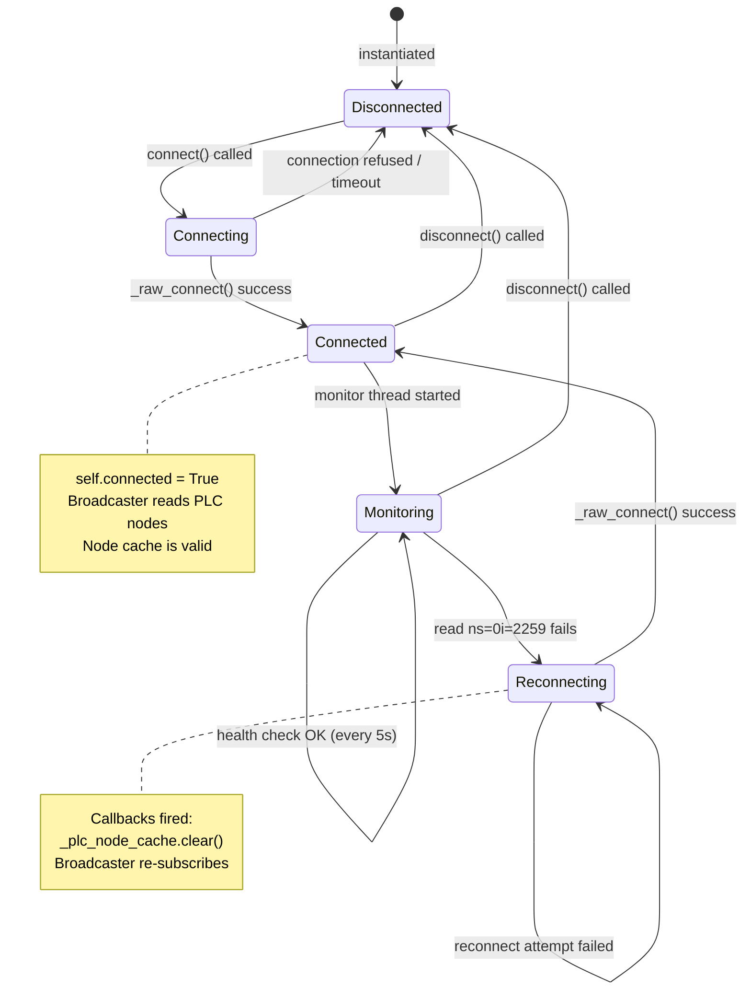
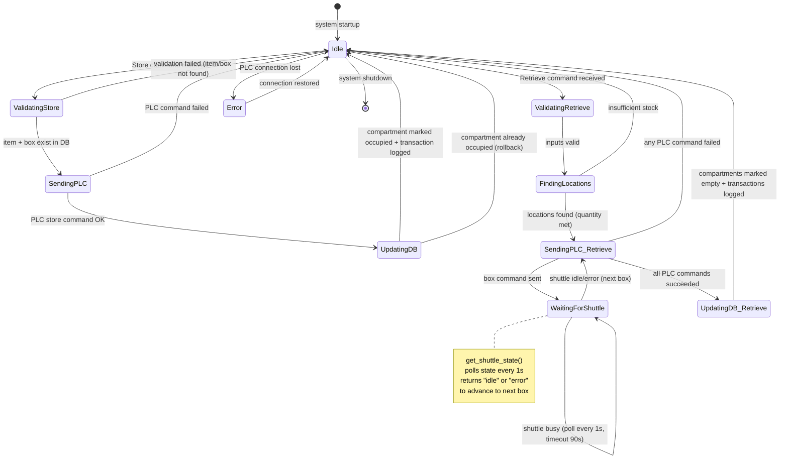
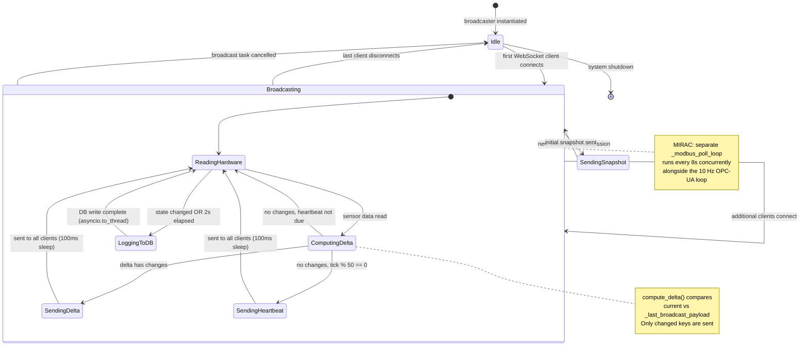

# SE Model 3: State Machine Diagrams (Statecharts)
## CoEDM Smart Manufacturing Control System

### Overview
State machine diagrams show the distinct states each major component can be in and the events/conditions that trigger transitions between states. Three statecharts are documented here, derived directly from the backend source code.

---

## Statechart 1: OPC-UA Connection Manager
*Source: `backend/communication/opcua_driver.py` — `OPCUAConnection` class*

The `OPCUAConnection` class manages a single persistent OPC-UA session per station (ASRS, MIRAC, TRIAC, Assembly). One instance exists per station.

**Key transitions from code:**
| Event | From State | To State | Code |
|-------|-----------|----------|------|
| `connect()` called | Disconnected | Connecting | `opcua_driver.py:42` |
| TCP session established | Connecting | Connected | `_raw_connect()` |
| Health check fails every 5s | Monitoring | Reconnecting | `_monitor_loop():172` |
| Reconnect success | Reconnecting | Connected | `reconnect():74` |
| `disconnect()` called | Any | Disconnected | `_raw_disconnect()` |

---

## Statechart 2: ASRS Operation Lifecycle
*Source: `backend/stations/asrs/asrs_logic.py` — `ASRSLogic` class + shuttle state machine*

The ASRS system orchestrates both the database and the physical shuttle. The shuttle state is polled during retrieval operations.

**Key states from code:**
| State | Meaning | Source |
|-------|---------|--------|
| `Idle` | No operation in progress | Initial / after commit |
| `ValidatingStore` | Checking item + box exist in DB | `asrs_logic.py:83-116` |
| `SendingPLC` | Issuing `{box_id}S` store pulse to ASRS PLC | `asrs_logic.py:119-137` |
| `UpdatingDB` | Marking compartment `occupied`, inserting transaction | `asrs_logic.py:139-207` |
| `WaitingForShuttle` | Polling `get_shuttle_state()` every 1s (max 90s) | `asrs_logic.py:341-347` |
| `UpdatingDB_Retrieve` | Marking compartments `empty`, inserting transactions | `asrs_logic.py:376-398` |

---

## Statechart 3: WebSocket Broadcaster (per station)
*Source: `backend/websockets/*_broadcaster.py` — e.g., `MiracBroadcaster`, `HydraulicBroadcaster`*

Each station has a dedicated broadcaster instance that manages the lifecycle of WebSocket clients and background polling tasks.

**Key state data from code:**
| State | `is_broadcasting` | `active_connections` | Trigger |
|-------|------------------|---------------------|---------|
| `Idle` | `False` | `{}` (empty set) | No clients connected |
| `Broadcasting` | `True` | `{ws1, ws2, ...}` | ≥1 client connected |
| `SendingSnapshot` | `True` | New ws added | `connect()` → sends `_last_broadcast_payload` |

---

*Previous: [DFD Level 1](./02_dfd_level1.md)*
*Next: [Class Diagram](./04_class_diagram.md)*
