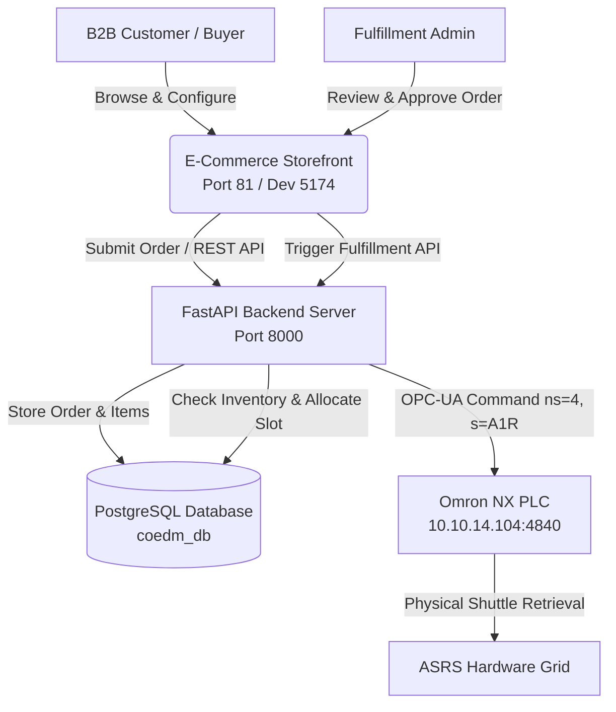

# CoEDM B2B E-Commerce Storefront & Order Fulfillment Portal

The **CoEDM E-Commerce Storefront** is a dedicated React/Vite single-page application designed for B2B industrial ordering, custom manufacturing product configuration, and automated warehouse fulfillment integration.

---

## 1. Overview & Purpose

The e-commerce module connects customer order placement directly to the factory floor's **Automated Storage & Retrieval System (ASRS)** and manufacturing execution pipelines. When a customer configures and places an order for custom hardware sub-assemblies (e.g., Bearings, Housings, Shafts), the order is registered in the core PostgreSQL database (`coedm_db`). Upon administrative approval in the fulfillment portal, the system automatically dispatches OPC-UA retrieval commands (`ns=4, s=<box>R`) to the Omron NX PLC controlling the physical ASRS crate grid.



---

## 2. Technical Architecture & Tech Stack

- **Framework**: React 18 with Vite (High-performance HMR and optimized production bundles).
- **Styling**: Tailwind CSS & Custom Warm Industrial Design Tokens (CSS variables in `src/index.css`).
- **State Management**: React Context API and custom REST hooks.
- **Backend Communication**: Axios / Fetch API targeting the core FastAPI backend (`http://localhost:8000/api/v1` in dev, `/api/v1` in production via proxy).
- **Real-Time Tracking**: WebSocket client listening for order status transitions and inventory allocation updates.

---

## 3. Key Features

### 3.1 Interactive Product Configurator
Allows B2B customers to customize multi-part mechanical assemblies before ordering:
- **Bearing Selection**: Select size, load rating, and material specifications.
- **Housing Mating**: Match appropriate housing units to bearing dimensions.
- **Shaft Assembly**: Choose shaft lengths, diameters, and keyway configurations.
- **Real-Time Validation**: Prevents incompatible component combinations from being added to the cart.

### 3.2 B2B Shopping Cart & Checkout
- Multi-line item ordering with custom reference PO numbers.
- Automated stock check against real-time ASRS inventory tables (`asrs_inventory`).
- Instant order confirmation with tracking UUIDs.

### 3.3 Fulfillment Admin Dashboard (`/admin`)
- **Order Queue**: View pending, approved, processing, and dispatched orders.
- **Automated ASRS Allocation**: When an order is processed, the dashboard displays which physical crate box (e.g., `A1` to `E7`) holds the required components.
- **One-Click Dispatch**: Trigger physical retrieval directly from the browser, initiating shuttle motion on the factory floor.

---

## 4. Setup & Running Locally

### 4.1 Prerequisites
- Node.js (v18+ recommended)
- npm or pnpm
- CoEDM FastAPI Backend running on port `8000`

### 4.2 Installation
```bash
cd ecom
npm install
```

### 4.3 Environment Configuration
Create a `.env` file in the `ecom/` directory (or copy from `.env.example` if present):
```env
VITE_API_BASE_URL=http://localhost:8000
VITE_WS_BASE_URL=ws://localhost:8000
```

### 4.4 Running Development Server
```bash
npm run dev
```
By default, the Vite dev server for the E-Commerce Storefront runs on `http://localhost:5174` (or port `81` when served in production via Nginx/Docker).

---

## 5. Integration with Factory Architecture

The E-Commerce module is fully decoupled from the physical PLCs; it never communicates directly with industrial equipment over Modbus or OPC-UA. Instead, it adheres strictly to the **Layered Security Architecture**:

1. **Presentation Layer**: `ecom` SPA renders UI and validates user input.
2. **Application Layer**: FastAPI backend receives order requests, validates against PostgreSQL inventory, and handles business logic.
3. **Hardware Driver Layer**: `opcua_driver.py` manages TCP sockets to `10.10.14.104:4840` and executes commands using `ns=4, s=` syntax.
