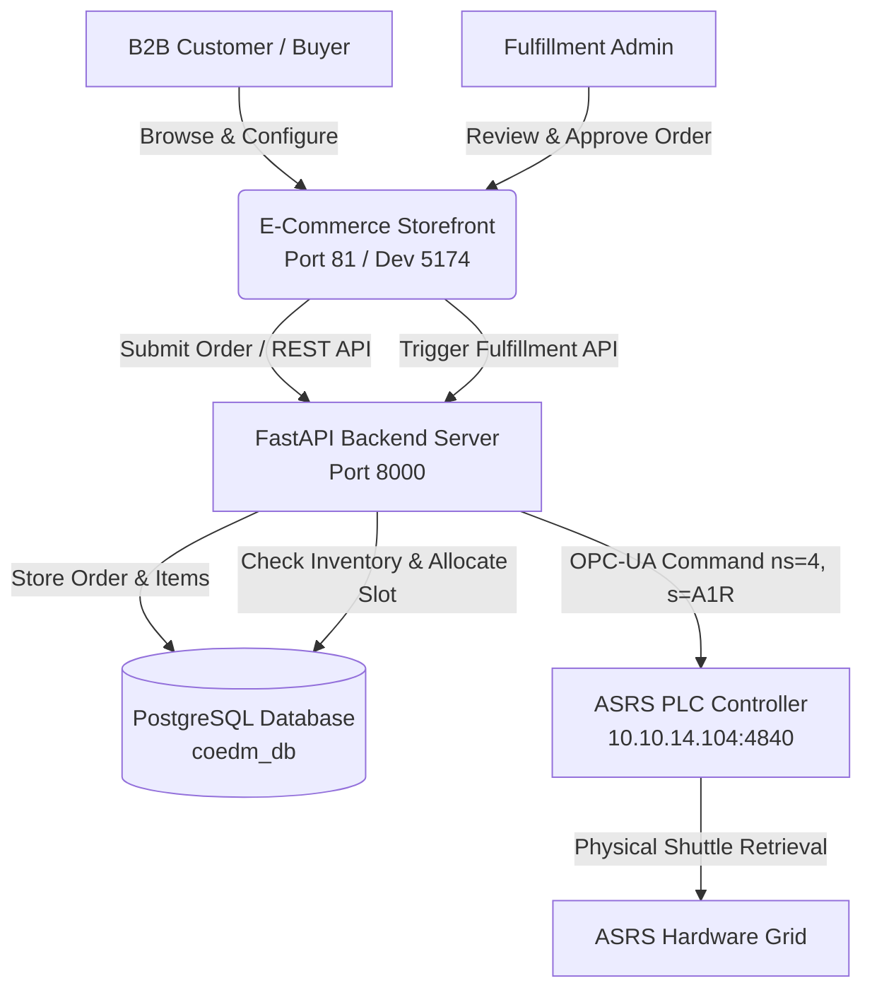

# CoEDM B2B E-Commerce Storefront & Order Fulfillment Portal

The **CoEDM E-Commerce Storefront** is a dedicated React/Vite single-page application designed for B2B industrial ordering, custom manufacturing product configuration, and automated warehouse fulfillment integration.

---

## 1. Overview & Purpose

The e-commerce module connects customer order placement directly to the factory floor's **Automated Storage & Retrieval System (ASRS)** and manufacturing execution pipelines. When a customer configures and places an order for custom hardware sub-assemblies (e.g., Bearings, Housings, Shafts), the order is registered in the core PostgreSQL database (`coedm_db`). Upon administrative approval in the fulfillment portal, the system automatically dispatches OPC-UA retrieval commands (`ns=4, s=<box>R`) to the ASRS PLC controlling the physical ASRS crate grid.



---

## 2. Technical Architecture & Tech Stack

- **Framework**: React 18 with Vite (High-performance HMR and optimized production bundles).
- **Styling**: Vanilla CSS & Custom Warm Industrial Design Tokens (CSS variables in `src/index.css`).
- **State Management**: React Context API and custom REST hooks.
- **Backend Communication**: Fetch API targeting the core FastAPI backend (`/api/ecom/*`).
- **Real-Time Tracking**: Polling and WebSockets for order status transitions and inventory allocation updates.

---

## 3. Key Features

### 3.1 Interactive Sub-Assembly Configurator (`/configure`)
Allows B2B customers to customize multi-part precision mechanical assemblies with live stock counters and CAD blueprints:
- **Shaft Selection**: Precision ground shafts machined at Station 3 (MIRAC CNC Lathe, h6 tolerance).
- **Bearing Mating**: Deep groove ball bearings (ABEC-5, GCr15 Chrome Steel, 14.8 kN dynamic load, Ø40mm OD).
- **Certified Housing Variants**: Milled at Station 4 (TRIAC CNC Centre, Ø40mm H7 bore):
  1. **Bracket Housing (`Bracket_40mm`)**: Asymmetric corner mount with 3× Ø9mm holes and 40° gusset rib.
  2. **Oval 2-Bolt Flange (`oval_40mm`)**: Rhombic oval 2-bolt flange (104×54mm) with 2× Ø9mm holes.
  3. **Square 4-Bolt Flange (`70sq_40mmdia`)**: 70×70mm square flange with 4× Ø7mm holes (PCD Ø75mm).
- **Dynamic CAD Preview & PDF Datasheet**: Toggle between composite render and 2D CAD engineering diagrams with automated spec sheet generation.

### 3.2 B2B Shopping Cart & Checkout
- Multi-line item ordering with custom reference PO numbers, GSTIN / Tax ID, and Factory Dispatch Priority.
- Automated stock check against real-time ASRS inventory tables (`storage_compartments`).
- Instant order confirmation with tracking links.

### 3.3 Fulfillment Admin Dashboard (`/admin`)
- **Order Queue & Manual Dispatch**: View orders and trigger physical ASRS shuttle retrieval directly from the browser.
- **ASRS PLC Monitor**: Real-time OPC-UA connectivity badge to the ASRS controller at `10.10.14.104:4840`.
- **Integrated User Manager**: Provision accounts, promote/demote administrator roles, activate/deactivate users, and export CSV logs.

---

## 4. Setup & Running Locally

### 4.1 Prerequisites
- Node.js (v18+ recommended)
- npm or pnpm
- CoEDM FastAPI Backend running on port `8000`

### 4.2 Installation
```bash
cd ecom
npm install
```

### 4.3 Environment Configuration
Create a `.env` file in the `ecom/` directory (or copy from `.env.example` if present):
```env
VITE_API_BASE_URL=http://localhost:8000
VITE_WS_BASE_URL=ws://localhost:8000
```

### 4.4 Running Development Server
```bash
npm run dev
```
By default, the Vite dev server for the E-Commerce Storefront runs on `http://localhost:5174` (or port `81` when served in production via Nginx/Docker).

---

## 5. Integration with Factory Architecture

The E-Commerce module is fully decoupled from the physical PLCs; it never communicates directly with industrial equipment over Modbus or OPC-UA. Instead, it adheres strictly to the **Layered Security Architecture**:

1. **Presentation Layer**: `ecom` SPA renders UI and validates user input.
2. **Application Layer**: FastAPI backend receives order requests, validates against PostgreSQL inventory, and handles business logic.
3. **Hardware Driver Layer**: `opcua_driver.py` manages TCP sockets to `10.10.14.104:4840` and executes commands using `ns=4, s=` syntax.
