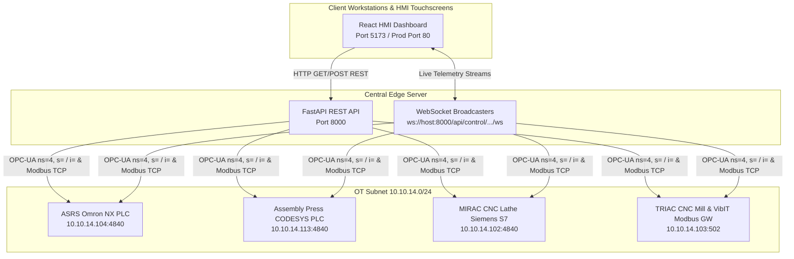

# CoEDM Smart Manufacturing Control System — React HMI Frontend

The **CoEDM HMI Frontend** is a modern, real-time industrial Human-Machine Interface (HMI) built with React and Vite. It provides operators, maintenance engineers, and plant managers with live telemetry, remote command capabilities, and diagnostic monitoring across all four manufacturing stations in the CoEDM facility.

---

## 1. System Overview & Architecture

The React HMI connects to the central FastAPI backend server over HTTP/REST (for static snapshots and configuration) and WebSockets (for sub-100ms streaming telemetry). It is engineered to run on industrial touchscreens, desktop workstations, and mobile tablets within the factory network.



---

## 2. Supported Hardware Stations & Features

### 2.1 ASRS (Automated Storage & Retrieval System) (`/asrs/dashboard`, `/asrs/operations`)
- **Live Visual Crate Grid**: Displays all 35 boxes (A1 through E7) across 5 columns and 7 rows, with color-coded status indicators (Occupied, Empty, Error, In-Transit).
- **Manual Shuttle Control**: Execute Store (`ns=4, s=<box>S`), Retrieve (`ns=4, s=<box>R`), and Home commands directly from the UI.
- **Transaction Logs**: Audit trail of all inventory movements and shuttle operations.

### 2.2 Hydraulic Assembly Press (`/assembly`)
- **Press Telemetry**: Real-time display of hydraulic pressure, displacement, bearing state, and safety light curtain status.
- **Interactive Command Controls**: Toggle bearing insertion, shaft alignment, and emergency stop overrides.
- **Safety Alerts**: Immediate visual warnings if the physical light curtain is tripped during an insertion cycle.

### 2.3 MIRAC CNC Lathe (`/mirac`)
- **Axis & Spindle Monitoring**: Live streaming of X/Z axis positions (`ns=4, i=11/12`), feed rates (`ns=4, i=14/15`), spindle speed (`ns=4, i=24`), and tool temperature/vibration.
- **Light Tower Mirroring**: Visual representation of the physical stack lights (Red LED `i=8`, Yellow LED `i=9`, Green LED `i=10`).
- **Remote Cycle Controls**: Trigger Cycle Start (`i=16`), Cycle Stop (`i=17`), and Remote Reset commands.

### 2.4 TRIAC CNC Mill & VibIT Analytics (`/triac`)
- **Triaxial Vibration Analysis**: High-frequency chart rendering of X, Y, and Z vibration acceleration and RMS metrics gathered via the Modbus TCP gateway (`10.10.14.103:502`).
- **Spindle Diagnostics**: Live thermal monitoring and tool wear estimation.

---

## 3. Tech Stack & Styling Design System

- **Core Framework**: React 18 + Vite for lightning-fast bundling and Hot Module Replacement (HMR).
- **Styling & Aesthetics**: Custom **Warm Industrial Design System** implemented via CSS variables in `src/index.css` and Tailwind CSS utility classes. Features high-contrast dark mode aesthetics, glassmorphism status panels, and smooth micro-animations for hardware state transitions.
- **Real-Time Data**: Native browser WebSocket API with automated exponential backoff reconnection logic.
- **Charting & Visualization**: Chart.js / Recharts for high-density sensor telemetry charting.

---

## 4. Local Development & Deployment Setup

### 4.1 Prerequisites
- Node.js (v18+ recommended)
- npm or pnpm

### 4.2 Installation
```bash
cd frontend
npm install
```

### 4.3 Environment Configuration
Create a `.env` file in the `frontend/` directory (or copy from `.env.example` if present):
```env
VITE_API_URL=http://localhost:8000
VITE_WS_URL=ws://localhost:8000
```

### 4.4 Running the Dev Server
```bash
npm run dev
```
The HMI dashboard will start on `http://localhost:5173`. When running against real hardware, ensure the workstation has network routing access to the central backend on port `8000`.

---

## 5. Verification & Testing

To verify frontend functionality without physical PLC connectivity:
1. Start the FastAPI backend server with mock or simulation mode enabled.
2. Navigate to `http://localhost:5173` and confirm that all four station tabs load without console errors.
3. Check the WebSocket status indicator in the top header—it should show a solid green dot indicating an active real-time telemetry feed.
